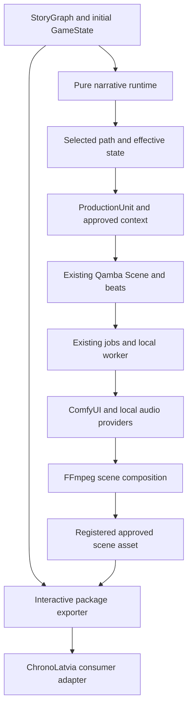

# ChronoLatvia interactive historical story studio: implementation plan

**Status:** implementation and local verification are in progress. This document records the original design and acceptance requirements; it is not a completion checklist. See [CHRONOLATVIA_STUDIO.md](CHRONOLATVIA_STUDIO.md) for implemented behavior, operating instructions, verified checks and remaining qualification.

**Repository inspected:** `D:\Src\qamba-studio-oss`, commit `b3e561f`, package version `0.2.3`.

**Plan date:** 7 October 2026, Europe/Riga.

**Input:** the user's attached Qamba customization prompt. It contains two substantially repeated copies of sections 1–27. Both copies stop at “Do NOT delegate deterministic rules to”. This plan covers every complete supplied requirement. Export details, transition semantics, storage decisions, and task boundaries below are explicit proposed implementation decisions that fill gaps in that prompt.

## 1. Instructions for the implementing agent

Read this section before changing any code.

1. Implement this plan in task-number order. Complete each task's acceptance checks before starting a dependent task.
2. Keep Qamba's existing linear film, series, and music-video behavior working. Add an opt-in interactive narrative mode.
3. Keep all application code in this repository unless the user separately authorizes changes to the ChronoLatvia game repository.
4. A StoryGraph scene node must reference a real row in Qamba's `scenes` table. Do not put beats, shots, clips, or ComfyUI graphs inside story nodes.
5. Narrative transitions run in one pure JavaScript module. Python receives validated production context; it does not independently execute game-state transitions.
6. Never derive a narrative predecessor from `Scene.idx`, `GenerationBlock.idx`, creation time, or the latest generated take. Interactive predecessors come from the selected simulation path.
7. Do not add a database server, account system, hosted orchestrator, or mandatory cloud provider.
8. Do not create a second generation queue. Use existing `jobs`, dependencies, cancellation, asset registration, and local worker execution.
9. Do not execute story-supplied JavaScript, Python, templates, or expressions. Conditions and effects are data with an allowlisted grammar.
10. Do not delete historical evidence, old takes, or old storyboard versions during conversion or regeneration.
11. Do not change `src/lib/localSchema.ts` manually. Change its input schema and generator, then regenerate it.
12. All new UUIDs are generated once and stored. A title or slug is a label, never an identifier.
13. Implement actual functions and tests. A disabled button, placeholder handler, hardcoded result, or unconnected ComfyUI template does not complete a task.
14. Run focused tests first, then the existing applicable suites. Report missing prerequisites and skipped checks explicitly.
15. Do not commit, push, publish, or download large model weights unless separately requested. A packaged-build check may build locally without publishing.
16. If the checkout has changed since `b3e561f`, re-read the named integration functions before editing them. Preserve unrelated user changes.

Each task below specifies **Create**, **Edit**, **Steps**, **Tests**, and **Done when**. “Create” paths do not exist yet. “Edit” paths were observed in the inspected checkout. All repository-relative paths resolve under `D:\Src\qamba-studio-oss`.

## 2. Verified repository architecture and impact analysis

These findings come from source inspection. Existing test files were identified, but application suites were not run for this documentation request. README claims about passing tests are not new verification evidence.

| Area                       | Existing implementation                                                                                                                                         | Required extension                                                                                              |
| -------------------------- | --------------------------------------------------------------------------------------------------------------------------------------------------------------- | --------------------------------------------------------------------------------------------------------------- |
| Desktop application        | React 18, TypeScript, Vite, React Router, Zustand, Tauri 2                                                                                                      | Add graph/history/simulation views inside the existing workspace shell.                                         |
| Project                    | `Project` in `src/lib/db/types.ts`; `medium` is `film`, `series`, or `music_video`; settings are an object                                                      | Add `settings.narrative_mode`, retaining the existing medium.                                                   |
| Episodes                   | `episodes` belong to projects; `mainEpisode` and `createEpisode` in `src/lib/db/projects.ts`                                                                    | Graphs may reference scenes across project episodes. Episodes remain production containers.                     |
| Storyboards                | Versioned `storyboards` belong to episodes                                                                                                                      | Pin scene references to explicit scene UUIDs; re-planning cannot silently switch graph bindings.                |
| Scenes                     | `scenes.storyboard_id`, `environment_id`, `cast_ids`, duration, prompt, still, metadata                                                                         | Reuse these rows as production blueprints referenced by SceneNodes.                                             |
| Beats and shots            | `worker/storyplan.py` stores narrative beats in `scenes.meta.beats`; the `beats` table represents production shots, with narrative linkage in `beats.meta.beat` | Do not add a new parallel shots table. Preserve this distinction in graph-to-scene planning.                    |
| Generation                 | `generation_blocks`, `block_takes`, ref plans, explicit `chain_from_block_id`                                                                                   | Scope interactive blocks by a production unit representing one scene and its approved visual context.           |
| Timeline                   | `timelines` belong to episodes; `tracks` and `clips` belong to cuts; sync follows active block takes                                                            | Add scene-production cuts that sync only their production unit. Keep episode cuts intact.                       |
| Story Bible                | `bible_entries`, `bible_assets`, `bible_revisions`; `loadBible`, `saveEntry`, `attachRef` in `src/lib/db/director.ts`                                           | Add structured historical metadata to lore entries and canonical metadata to existing entity entries.           |
| Characters/locations/props | Bible kinds `character`, `environment`, `prop`; reference roles include face, body, turnaround, master, alternate angle, detail, atmosphere, coverage           | Reuse identities and reference assets. Model costumes as prop entries with a costume subtype.                   |
| Existing variants          | `BibleEntryModal.tsx` creates child entries with `doc.variant_of`; dialogue inherits the parent voice                                                           | Formalize one root identity, state-driven variant selection, provenance, and approval.                          |
| Lore/source text           | `rag_documents`, `rag_chunks`, `src/lib/db/lore.ts`, import/extraction modals                                                                                   | Preserve text ingestion; add a source registry, citations, immutable documented claims, and offline retrieval.  |
| Continuity                 | Blocking/positions in `worker/storyplan.py`; reference compilation in `worker/handlers/blocks.py`; `src/lib/staleBlocks.ts`                                     | Add path context and dependency-based invalidation. Existing worker helpers still use linear index lookups.     |
| ComfyUI                    | `src/lib/comfyLocal.ts`, `localGraphs.ts`, `localRender.ts`, workflow adapters; Python `comfy.py`, `graphs.py`, `resolve.py`, `resolve_custom.py`               | Keep media-only workflows; add approved canonical inputs and explicit provider capability checks.               |
| Queue                      | `src/lib/db/jobs.ts`, `localWorker.ts`, `desktopPlanner.ts`; Python `plan_cli.py`                                                                               | Register new runnable kinds in every dispatch/capability list. Use the single local lane.                       |
| Dialogue/TTS               | `Beat.dialogue` has speaker/line/delivery/offscreen; `dialogue_synth.py`, `dialogue_spine.py`, `voice_engines.py`, local Breeze/Qwen bridges                    | Add language/emotion/intensity/pace and truthful capability handling; synthesize before lip-sync.               |
| Music/SFX                  | `handlers/music.py`, `handlers/sfx.py`, `handlers/v2a.py`, `score_prompt.py`, `score_mix.py`                                                                    | Separate dialogue, music, ambience, and timed effects; require instrumental intent where configured.            |
| Composition                | `handlers/render.py`, `render_output.py`, `audio_fx.py`, `mix.py`; JS preview twins                                                                             | Reuse FFmpeg editing and audio effects; add verified ducking/master normalization/limiting where missing.       |
| Local LLM/VLM              | Local director uses Ollama; Python has Ollama and `openai-compat`; `worker/vlm.py` samples frames for local vision                                              | Add desktop configuration for local compatible endpoints; route semantic proposals through validators.          |
| File persistence           | `LocalStore`, `StoreSnapshot.version = 1`, `localPlane.ts`; Rust `localstore.rs` writes project JSON/media                                                      | Version the extended format, add migration backups and atomic multi-row commands.                               |
| Python access to project   | Loopback proxy `dbproxy.rs` → `localDbBridge.ts` → `localRest.ts`/`localRpc.ts`; session token scoped to a run/project                                          | Reuse it. Python must not become a second writer of `project.json`.                                             |
| Frontend state             | Workspace chrome in `useWorkspaceStore`; timeline/playback stores; project rows through `useLiveQuery` and local store                                          | Keep graph business data in project rows; only selection/viewport/undo session state belongs in graph UI state. |
| Tests/CI                   | Node tests, director tests, Python pytest, Rust tests, browser UI harness; `.github/workflows/ci.yml`                                                           | Add contract/runtime/branch isolation tests and a local graph UI harness; preserve existing gates.              |

### 2.1 Concrete traps in the existing code

1. `LocalStore.fromSnapshot` drops unknown tables. Saving interactive rows under snapshot version 1 would allow an older build to silently remove them. Increment the snapshot version before any new-table project is saved.
2. `scripts/sqlSchema.mjs:readOwnership` reads the ownership map from the fixed `20260812190000_accounts.sql` file. Adding tables in a new SQL file alone will not add them to `LOCAL_TABLES`. Task 03 specifies the required extension mechanism.
3. `worker/planner.py:plan_blocks` packs an ordered scene list and may merge adjacent scenes. For interactive production, call it with exactly one selected scene and keep graph transitions outside the packer.
4. `worker/handlers/blocks.py:handle_launch_render` loads every scene of a storyboard, replaces prior planned blocks, and assigns predecessor blocks from list order. Interactive execution needs a separate scoped branch of this handler.
5. `_next_opening` in the same worker file looks up `idx + 1`. `_mark_downstream_stale` marks later chained indices. Both must use explicit production dependencies for interactive units.
6. `generation_blocks` currently has a unique `(storyboard_id, idx)` constraint. Multiple state-dependent renders of one existing scene need a production-unit scope; changing only job payloads is insufficient.
7. `syncBlocksToTimeline` operates on a storyboard. An interactive scene cut must not receive every branch's blocks.
8. `active_take_id` belongs to a block. Distinct production units must have distinct blocks, so selecting a take for an injured variant cannot repoint the healthy variant's cut.
9. The desktop build does not ship the automatic `take_review`/`visual_review_batch` pipeline. `vlm_query` exists, but it is not automatic approval.
10. `workflows/lipsync_latentsync.json` exists; it is marked as a legacy non-desktop handler in `src/lib/workflows.ts`. The referenced legacy handler is absent from this OSS checkout. Wire a new local provider rather than treating this file as a working feature.
11. `worker/llm.py:embed_texts` requires `OPENAI_API_KEY`; `rag_search` calls `match_rag_chunks`, which is not implemented by the current local RPC switch. Offline historical retrieval needs explicit new work.
12. A ducking field exists on tracks, but the inspected render/mix code does not establish a complete working ducking feature. Implement and measure it; do not mark the requirement complete from the field alone.
13. Some source comments describe the older hosted product. Actual OSS dispatch and storage code determine behavior.
14. `npm test` matches `director/*.test.mjs` and `src/*/*.test.ts`; it does not include arbitrary nested tests. Put new pure-module tests directly in `src/lib/` or explicitly update the test command.

## 3. Fixed architecture decisions

Treat the following decisions as the implementation contract. Change them only if implementation evidence proves a contradiction, and record that evidence before changing the plan.

### 3.1 Three independent graphs

Keep these concepts separate in names, types, and UI:

- **StoryGraph:** player traversal, choices, conditions, state, historical events, endings.
- **Production job DAG:** prerequisites between queued image/video/audio/assembly jobs.
- **ComfyUI workflow graph:** model nodes for one media operation.

Do not reuse `worker/graphs.py` for StoryGraph logic; that module builds ComfyUI graphs.



### 3.2 Narrative mode and scope

- Add `ProjectSettings.narrative_mode: "linear" | "interactive"`; default `linear` for old/new ordinary Qamba projects.
- Keep `Project.medium` unchanged. An interactive story can use film-style production without pretending to be a new video medium.
- Store graphs at project scope. A graph's scene references may resolve to any episode/storyboard within that project.
- Persist exact scene UUIDs. Never bind to “the latest storyboard”.
- When a storyboard is revised, show a scene-rebinding diff. Apply accepted rebindings as one graph revision; retain old scenes and takes.
- A scene may be referenced by multiple graph nodes. Different narrative entry effects remain on those nodes; the media blueprint remains the existing scene.
- Version 1 stories must be directed acyclic graphs. Detect and report cycles in draft graphs; block simulation/export until they are repaired. Intentional bounded loops are a later contract version, not an undocumented v1 behavior.

### 3.3 Runtime ownership

Create `director/story_runtime.js` as a pure ESM module with no React, browser globals, Node built-ins, network, filesystem, Python, or provider dependencies.

It owns:

```text
evaluateCondition(condition, state, definitions) -> { ok, reasons[] }
applyEffects(state, effects, definitions) -> { ok, state?, errors[] }
startSession(graph, definitions, initialState) -> session or error
listChoices(graph, session) -> available[] and blocked[] with reasons
stepSession(graph, session, edgeId) -> new session or error
replaySession(graph, definitions, initialState, edgeIds[]) -> session or error
```

The editor and simulator import it directly. Export its exact source plus an engine version/hash with the package. The future ChronoLatvia adapter must use it or pass the same conformance fixtures. Python consumes a validated, captured context produced by this module and never reimplements its state rules.

### 3.4 Graph persistence

Store a graph's nodes, edges, state definitions, initial state, and editor layout in one versioned document on a `story_graphs` row. An aggregate avoids partial edge/choice edits. It is still a real graph with node/edge identity and adjacency; it is not an ordered scene list.

Use these new local tables:

| Table                    | Required fields and purpose                                                                                                                                                                                                                                          |
| ------------------------ | -------------------------------------------------------------------------------------------------------------------------------------------------------------------------------------------------------------------------------------------------------------------- |
| `story_graphs`           | `id`, `project_id`, `title`, `schema_version` (1), `revision` (positive integer), `status` (`draft` or `reviewed`), `document` (GraphDocument), `created_at`, `updated_at`.                                                                                          |
| `story_graph_revisions`  | `id`, `graph_id`, `project_id`, `revision`, `document`, `reason`, `created_at`. Append-only prior versions; unique `(graph_id, revision)`.                                                                                                                           |
| `story_graph_scene_refs` | Composite key `(graph_id, scene_id)`; graph/project ownership; scene FK restricts scene deletion. This is a derived binding index, not another scene model.                                                                                                          |
| `story_simulations`      | `id`, `graph_id`, `project_id`, `graph_revision`, `label`, `edge_history`, `debug_start` (nullable), `created_at`, `updated_at`. Store paths, not a complete GameState copy at every node.                                                                           |
| `historical_sources`     | `id`, `project_id`, `kind`, `title`, `url` (nullable), `asset_id` (nullable), `rag_document_id` (nullable), `citation`, `creator`, `date_label`, `accessed_at` (nullable), `rights_note`, `sha256` (nullable), `created_at`, `updated_at`.                           |
| `production_units`       | `id`, `project_id`, `graph_id`, `graph_revision`, `node_id`, `scene_id`, `storyboard_id`, `context_hash`, `context` (immutable captured production context), `predecessor_unit_id` (nullable), `approved_asset_id` (nullable), `status`, `created_at`, `updated_at`. |

All row IDs are UUIDs except the composite binding index. `node_id` is a graph-document UUID checked by application validation. Cross-project references are rejected even if both UUIDs exist.

Use SQL `uuid` for identifiers, `integer` for schema/revision counters, `jsonb` for documents/context/history, `text` for labels/hashes, and `timestamptz` for timestamps. Use UUID/time defaults only in patterns the existing generator understands. Declare JSON defaults explicitly (`{}` for objects, `[]` for lists). Project IDs and required parent IDs are non-null. Graph revision counters start at 1.

Production-unit statuses are exactly `draft`, `queued`, `generating`, `review`, `approved`, `stale`, and `failed`. `review` means the completed scene output awaits human approval. Approval pins the exact final asset UUID. A changed input changes status to `stale`, retains the old approved asset for comparison, and makes that asset ineligible for a new export. Retry creates jobs for the captured unit inputs; changed inputs require a new unit.

Use project cascade only for deleting an entire project. Restrict deletion of scenes/source assets used by active graph/canonical records. Require an explicit detach/rebind action before deletion. Graph node deletion never deletes its Qamba scene or media.

### 3.5 Atomic commands

Add an atomic mutation primitive to `LocalStore` before implementing multi-row graph saves. It must:

1. Stage changes on isolated data; do not emit change events during staging.
2. Validate every command and all affected references.
3. Replace the affected data and update the revision/pending ledger only if all operations succeed.
4. Emit one combined store-change event after commit.
5. Restore original rows, indexes, pending ledger, and store revision after failure.

Implement `save_story_graph` in `localRpc.ts`, with `{ graph_id, expected_revision, document, reason }`. Compare `expected_revision` before committing. In one transaction, archive the previous document, write the next document, and replace the derived scene-reference index. Reject stale saves with `STORY_REVISION_CONFLICT`; never silently overwrite another command.

Graph drafts may contain unfinished connections and unreachable nodes. They may not contain malformed objects, unsafe paths, invalid effects, duplicate UUIDs, or cross-project scene references. Full readiness validation is a separate command.

### 3.6 Historical and canonical records

- Historical facts remain `bible_entries` of kind `lore`, with `doc.historical` containing the typed historical record. HistoricalBible is a dedicated view/service over these entries plus `historical_sources`.
- Do not duplicate the existing lore or character registry.
- A canonical identity is an existing character/environment/prop BibleEntry root with `doc.canonical` metadata.
- Existing child entries with `doc.variant_of` remain production variants of that root. GameState character identity always uses the root UUID.
- A costume is an existing prop entry with `doc.canonical.entityKind = "costume"`.
- Extend asset/link metadata for explicit plate orientation, approval, provenance, and versions; keep image bytes in the existing `assets` registry/media directory.

## 4. Exact narrative contract

Create JSON contract files in `contracts/story/v1/`. These document and validate the public package shape. Use `additionalProperties: false` on contract objects; allow freeform author notes only in designated `metadata` objects. Set depth/size limits in the application validator rather than allowing arbitrary imported recursion.

### 4.1 GraphDocument

```text
GraphDocument {
  schemaVersion: 1
  engineVersion: string
  entryNodeId: UUID
  defaultLanguage: BCP-47 language tag, initially "lv"
  nodes: StoryNode[]
  edges: StoryEdge[]
  stateDefinitions: StateDefinitions
  initialState: GameState
  editor: { positions: Record<UUID, {x:number,y:number}>, viewport:{x:number,y:number,zoom:number} }
  metadata: object
}

StoryNode base {
  id: UUID
  type: "scene" | "decision" | "conditional" | "historical_event" | "ending"
  title: string
  condition: Condition | null
  enterEffects: Effect[]
  sourceRefs: CitationRef[]
  tags: string[]
}

StoryEdge {
  id: UUID
  sourceNodeId: UUID
  targetNodeId: UUID
  sourcePort: "next" | "fallback" | UUID   // UUID is a choice ID or conditional-case ID
  label: string
  condition: Condition | null
  effects: Effect[]
}
```

`edges` are the sole authority for target nodes. Do not store another `next` field on nodes/choices. The examples in the attachment use `next` for explanation; keeping both `next` and edges would create conflicting truth.

### 4.2 Node-specific fields and connection rules

| Type               | Fields in addition to the base                            | Outgoing connection rule                                                      |
| ------------------ | --------------------------------------------------------- | ----------------------------------------------------------------------------- |
| `scene`            | `sceneId: UUID`, `presentation: { subtitleAssetId: UUID   | null, posterAssetId: UUID                                                     | null }`                                                                  | Exactly one `next` edge in a ready graph.                                         |
| `decision`         | `prompt: string`, `choices: Choice[]`                     | Exactly one edge per choice UUID; no generic `next` edge.                     |
| `conditional`      | `cases: {id:UUID,label:string,condition:Condition}[]`     | Exactly one edge per case UUID and one `fallback` edge.                       |
| `historical_event` | `historicalEntryId: UUID`, `explanation: string`          | Exactly one `next` edge; the cited historical record supplies factual claims. |
| `ending`           | `classification: string`, `outcomes: Record<string,number | string                                                                        | boolean>`, `historicalExplanation: string`, `educationalSummary: string` | No outgoing edges. Classification is an author label, not a forced good/bad enum. |

`Choice` fields: `id`, `label`, `iconAssetId` (nullable), `condition` (nullable), `effects` (array), `historicalAnnotation`, `educationalExplanation`, `sourceRefs`, `tags`. Require at least one choice in a ready decision.

Conditional cases use **exclusive matching**: evaluate all cases against the same state. Zero matches selects fallback; exactly one match selects that case; multiple matches produce `STORY_AMBIGUOUS_CONDITIONAL` and leave the session unchanged. Do not silently select the first case.

An EndingNode may be reached from several incoming edges. Outcome dimensions include survival, freedom, family, trust, historical impact, knowledge, and relationships, with units/meaning defined in story metadata.

### 4.3 GameState and definitions

```text
GameState {
  variables: Record<string, number|string|boolean>
  flags: Record<string, boolean>
  historicalFlags: Record<string, boolean>
  inventory: UUID[]
  knowledge: UUID[]
  relationships: Record<rootCharacterUUID, Record<rootCharacterUUID, number>>
  characters: Record<rootCharacterUUID, {
    alive: boolean,
    status: string,
    locationId: UUID|null,
    injuries: string[],
    appearanceVariantId: UUID|null,
    costumeId: UUID|null,
    carriedPropIds: UUID[]
  }>
  world: { historicalTime: string|null, timeOfDay: string, weather: string }
}
```

`StateDefinitions` declares every legal scalar path with type, default, optional flag, optional numeric minimum/maximum, and enum values. It also declares legal item/knowledge IDs, root character IDs, location IDs, injury/status labels, and variant ownership. `initialState` must validate against it.

Use finite IEEE-754 numbers, identical JavaScript arithmetic in producer/consumer, and explicit bounds. Reject NaN, infinities, coercion, and out-of-bounds results. Use integers for counters unless an author explicitly defines a decimal variable. Canonical serialization must normalize negative zero to zero.

Inventory, knowledge, injuries, and carried props have set semantics: no duplicates; canonical serialization sorts them. Effects preserve explicit values; array positions never become identity.

State variable/flag keys use `[A-Za-z][A-Za-z0-9_]{0,63}`; dots are separators, not characters in keys. UUID segments in character/relationship paths must match registered root identities. Build a complete initial state from declared defaults when creating the story, then persist it. Loading/simulating an incomplete state is an error; do not silently introduce defaults halfway through a path.

Relationship values are directed: A's trust in B does not automatically change B's trust in A. Declare both paths if both should change.

`historicalFlags` describe a fictional character's experience/knowledge or story progress. They never modify a documented event's statement/date/location. `world.historicalTime` cannot move backward on a v1 production path unless a future explicit time-travel contract is introduced.

### 4.4 Conditions

Use exactly one of these forms:

```json
{ "path": "variables.suspicion", "operator": "lt", "value": 60 }
```

```json
{
  "all": [
    { "path": "flags.knowsForestRoute", "operator": "eq", "value": true },
    { "path": "variables.suspicion", "operator": "lt", "value": 60 }
  ]
}
```

```text
Condition = comparison | {all: Condition[]} | {any: Condition[]} | {not: Condition}
comparison = {path:string, operator:Operator, value?:scalar}
Operator = eq | neq | gt | gte | lt | lte | contains | notContains | exists | notExists
```

Rules:

1. `null` means no condition and evaluates true. Reject empty `all`/`any` lists.
2. `eq`/`neq` compare scalar values with strict type equality; no string-to-number coercion.
3. Ordering operators accept numeric scalar paths and numeric values only.
4. `contains`/`notContains` use exact membership for arrays or case-sensitive substring matching for strings. Reject all other target types.
5. `exists`/`notExists` have no `value`; existence means a declared optional property is present. A present null value exists.
6. Missing optional paths return false for comparisons, including `neq` and `notContains`; authors must explicitly use `notExists` if absence is intended.
7. Resolve paths by a split-and-walk allowlist. Reject `__proto__`, `prototype`, `constructor`, empty segments, array indexing, brackets, wildcards, and undeclared paths.
8. Maximum imported condition depth: 16. Maximum predicates per condition: 256. Return a diagnostic rather than recursing past a limit.
9. Return structured blocked reasons with path/operator/expected/actual values and a readable explanation. Do not expose source code to authors.

### 4.5 Effects

```json
[
  { "operation": "increment", "path": "variables.suspicion", "value": 15 },
  { "operation": "set", "path": "flags.knowsForestRoute", "value": true }
]
```

Use `{operation,path,value}` with `set`, `increment`, `decrement`, `add`, or `remove`.

- `set`: assign a declared scalar, nullable reference, or a complete declared set array after type/reference validation.
- `increment`/`decrement`: numeric paths only; use the given nonnegative finite amount. Reject missing numeric targets and invalid resulting bounds.
- `add`/`remove`: set-valued array paths only. Add an existing value or remove an absent value is a deterministic no-op.
- Do not permit deleting an arbitrary state property, adding undeclared paths, modifying schema, or altering historical records.
- Validate every effect at graph save time. Validate its actual result again at execution time.
- Apply an effect list in its written order to a cloned candidate state. If any effect fails, publish no partial state.
- Maximum effects per node/choice/edge: 256. Reject larger lists.

### 4.6 Transition order: implement exactly

For a decision choice, `stepSession` must perform these actions in this order:

1. Verify session graph revision, current node, and that the supplied edge belongs to its chosen choice.
2. Evaluate choice and edge conditions against the current state, before effects.
3. Clone the current state; apply choice effects, then edge effects.
4. Evaluate the target node's condition against this candidate state.
5. Apply the target node's entry effects to the candidate state.
6. Validate the complete candidate state and applicable immutable historical constraints.
7. Only on success, append one history entry, move current node, and publish the new state.

For ordinary/conditional/event transitions, omit choice effects; use the same remaining order. Start applies the entry node condition and entry effects exactly once. A rejected transition makes no state/history changes. Backtracking and arbitrary-node inspection replay from the beginning; they do not reverse effects by guessing inverses.

Scene nodes pause for author/player media completion. Decision nodes pause for choice. Ending nodes terminate. Conditional and historical-event nodes auto-advance through the same step function. A maximum of 10,000 total traversed edges and 1,000 consecutive auto-advances protects the UI; exceeding either produces an explicit error.

At reconvergence, replay each selected path independently. Never merge ancestor branches or union their states.

### 4.7 Concrete reconvergence fixture instructions

Use these literal UUIDs in the test fixture. The fixture loader creates corresponding ordinary Qamba scene/Bible rows; it must not expect these UUIDs to exist in a user's real project.

| Entity                | Fixed test UUID                        |
| --------------------- | -------------------------------------- |
| StationScene node     | `10000000-0000-4000-8000-000000000001` |
| Decision node         | `10000000-0000-4000-8000-000000000002` |
| CellarScene node      | `10000000-0000-4000-8000-000000000003` |
| ForestScene node      | `10000000-0000-4000-8000-000000000004` |
| SharedScene node      | `10000000-0000-4000-8000-000000000005` |
| Conditional node      | `10000000-0000-4000-8000-000000000006` |
| Uninjured ending      | `10000000-0000-4000-8000-000000000007` |
| Injured ending        | `10000000-0000-4000-8000-000000000008` |
| Anna root Bible entry | `50000000-0000-4000-8000-000000000001` |

Assign the four scene rows IDs with the prefix `30000000-0000-4000-8000-` and suffixes `000000000001` through `000000000004`, respectively. Use `20000000-0000-4000-8000-` plus numbered suffixes for edges and `40000000-0000-4000-8000-` plus numbered suffixes for choices/cases. Keep each ID unique and stable across fixture serialization.

Initialize `variables.suspicion = 20`, `flags.injured = false`, and Anna's injuries to `[]`. The hide choice decrements suspicion by 10. The run choice increments suspicion by 15, sets `flags.injured` true, and adds `leg_injury` to Anna's declared injuries set. No other fixture node/edge changes these values. SharedScene uses the same scene UUID on both paths.

At Conditional, one case checks `flags.injured eq true` and targets the injured ending; fallback targets the uninjured ending. Assert the exact shared-node states (10/false/empty injuries versus 35/true/leg injury), the exact ending IDs, and distinct visual signatures. Add a separate overlapping-case negative fixture; the main fixture is exclusive.

## 5. HistoricalBible and canonical production contract

### 5.1 Historical records and source citations

`BibleEntry.doc.historical` must contain:

```text
{
  classification: "DOCUMENTED" | "PLAUSIBLE" | "FICTIONAL",
  statement: string,
  date: {label:string, earliest:string|null, latest:string|null, precision:string},
  locationEntryId: UUID|null,
  sourceRefs: CitationRef[],
  confidence: "high" | "medium" | "low",
  mutable: boolean,
  review: {status:"draft"|"approved"|"needs_review", reviewedAt:string|null, note:string}
}

CitationRef { sourceId:UUID, locator:string, excerpt:string|null, note:string }
```

Use source kinds: `photograph`, `map`, `archival_document`, `newspaper`, `dataset`, `book`, `museum_reference`, `url`, `citation`. A source may contain a local file, text document, URL, or bibliographic citation. A book does not need a fabricated URL. Page/archive/map-coordinate locators belong in CitationRef.

For DOCUMENTED records, require `mutable = false`, at least one resolvable source, and human historical approval before production export. Enforce this in normal service/store writes and director/Python writes, not only prompts. AI proposals may quote or link a documented fact; they cannot rewrite, delete, or downgrade it. A human correction creates an auditable new revision with the reason and cited evidence; old versions remain available.

Evidence classification and review status are separate. “Generated”, “high confidence”, and “VLM passed” never imply documented evidence.

Allow source references on Bible entries, scenes (`Scene.meta.sourceRefs`), nodes, choices, production units, and generated assets (`Asset.meta.sourceRefs`). Preserve source revision hashes in approved production context. Derived assets inherit citations from inputs and record the generated interpretation as such.

Import files through existing asset registration/media storage. Do not automatically fetch every URL or execute imported HTML. A source may remain URL-only and visibly unavailable offline. Preserve originals; OCR/summaries are derived text. PDF/OCR extraction is optional enrichment after the basic registry, citation editor, and manual text import work.

### 5.2 Canonical records

Add `doc.canonical` with `entityKind`, `rootEntryId`, `revision`, `approval`, `sourceRefs`, `historicalPeriod`, and `variantRules`.

- Root entries point `rootEntryId` to themselves.
- Variant entries retain `doc.variant_of` and point `rootEntryId` to the root.
- Reject parent cycles and cross-project ancestry.
- Preserve voice inheritance. A wardrobe change does not create a new GameState character.
- Variant rules match declarative state conditions to approved child entries. Multiple matching rules without one explicitly selected winner produce an error, not a random pick.
- The author can explicitly choose a variant in a saved production context. That selection must agree with root ownership and required injury/costume state.

Store plate orientation in `Asset.meta.canonicalPlate`: `front`, `rear`, `left`, `right`, `wide`, or `detail`. Keep existing BibleAsset roles for selection; do not force all six orientations into one role called “ref”. Canonical environments may have period/weather/time-of-day variants, all under the same location identity.

### 5.3 ProductionContext and reuse

Capture this immutable object before queueing generation:

```text
{
  schemaVersion:1, graphId:UUID, graphRevision:number, nodeId:UUID, sceneId:UUID,
  edgeHistory:UUID[], stateHash:string,
  effectiveState:GameState,
  visualSignature:object,
  canonicalSelections:{rootEntryId:UUID,variantEntryId:UUID,assetIds:UUID[],revision:number}[],
  historicalRefs:CitationRef[], historicalRevisionHashes:object,
  predecessor:{unitId:UUID,blockId:UUID,takeId:UUID,assetId:UUID}|null,
  successorOpening:object|null,
  productionSettings:object,
  inputHash:string
}
```

`visualSignature` includes cast/root identities, selected variants/costumes, injuries, carried props, positions, location/plate revision, historical time, time of day, weather, required action, and camera continuity. It includes dialogue language/text/voice and sound design when those affect output. It excludes unrelated narrative counters unless they affect that scene's presentation.

Compute `context_hash` from the canonicalized scene/beat blueprint, visual signature, exact approved reference/take IDs, source revisions, and generation settings. Do not key it solely by node UUID or full edge history. Two paths may reuse a scene asset only when their production inputs are equivalent. Their narrative states remain separate.

If a shared scene needs both injured and healthy visual states, create two production units over the **same scene UUID**. Do not clone the character identity or add an alternative scene model. If the author wants different dialogue/shot structure, create a distinct ordinary Qamba scene and bind a distinct SceneNode explicitly.

Unresolved visual continuity at a reconvergence is a production blocker. The author must select separate variants or deliberately reset the composition to an approved canonical establishing shot. Do not automatically choose the last generated sibling branch.

## 6. Task sequence and dependencies

```text
01 baseline and fixtures
  -> 02 contract and pure runtime
  -> 03 storage, commands, migration
  -> 04 validators and analysis
  -> 05 graph editor
  -> 06 simulator
  -> 07 HistoricalBible/offline retrieval
  -> 08 canonical references/reconstruction
  -> 09 production-unit and continuity isolation
  -> 10 media workflow orchestration
  -> 11 speech, lip-sync, and composition
  -> 12 local providers and offline enforcement
  -> 13 LLM proposal tools
  -> 14 export and consumer conformance
  -> 15 end-to-end qualification and handoff
```

Tasks 07 and 12 are necessary before claiming the first fully offline historical production. A minimal graph UI milestone after Task 06 is useful but does not complete this plan.

### Task 01 — establish baseline and deterministic fixtures

**Create:** `contracts/story/v1/fixtures/reconvergence.json`, `contracts/story/v1/fixtures/invalid-cases.json`.

**Edit:** no application behavior in this task.

**Steps:**

1. Read repository/ancestor `AGENTS.md` and `CLAUDE.md` if present. None was found in the inspected workspace or `D:\Src` during planning.
2. Record `git status`, current commit, Node/Python/Rust versions, and available local engines. Do not print stored API keys.
3. Install locked development dependencies only if needed. Use Node 24 for the baseline; CI uses Node 24 and the Node test runner strips TypeScript.
4. Run the commands in section 9. Record existing failures separately; do not weaken assertions to establish a green baseline.
5. Create the fixed fixture topology below with literal valid UUIDs, stable slugs as labels, and no external provider calls.
6. Make the fixture historical material explicitly fictional. Do not label invented station details as documented evidence.

**Fixture topology and values:** implement section 4.7 exactly. Include one additional documented-record test fixture with a clearly marked synthetic citation solely to test locking, never for publication.

**Tests:** fixed paths yield suspicion 10/uninjured and 35/injured at the same shared node; both endings are reachable. The production variant fixture has distinct visual signatures.

**Done when:** baseline evidence and reusable data fixtures exist; no production feature has been claimed.

### Task 02 — implement schemas and pure narrative runtime

**Create:** `contracts/story/v1/graph.schema.json`, `state.schema.json`, `package.schema.json`; `director/story_runtime.js`; `src/lib/storyTypes.ts`, `storySchema.ts`, `storyRuntime.test.ts`, `storySchema.test.ts`.

**Steps:**

1. Encode the contract in section 4. Include all five node types, explicit UUID edge/choice identity, citations, ending dimensions, state definitions, and schema versions.
2. Implement runtime structural validation in `storySchema.ts`. JSON Schema files and TypeScript types must describe the same shape; add shared positive/negative fixtures to detect drift.
3. Implement the six runtime functions listed in section 3.3. Keep the runtime module independent of Qamba rows/UI.
4. Return structured error codes, entity IDs, and readable reasons. Use `STORY_INVALID_PATH`, `STORY_INVALID_EFFECT`, `STORY_BLOCKED_TRANSITION`, `STORY_AMBIGUOUS_CONDITIONAL`, and `STORY_REVISION_CONFLICT` consistently.
5. Never mutate input graph/state/session objects. Apply effects atomically and implement the precise transition order.
6. Include graph identity/revision, current node, edge history, visited node IDs, current state, and ending outcome in sessions.

**Tests:** every operator/effect; wrong types; optional absent/null paths; malicious paths; nested condition limits; bounds; no partial effects; entry effects exactly once; pre-effect guards versus post-effect target guards; ambiguous conditional; reconvergence; restart/replay; terminal endings; deterministic serialization.

**Done when:** the fixture completes both paths without UI, Python, network, or LLMs; negative fixtures fail with expected codes.

### Task 03 — add durable storage and atomic graph commands

**Create:** `supabase/migrations/20261007120000_interactive_story_schema.sql`, `contracts/local-schema-extensions.json`, `src/lib/storyMigrations.ts`, `storyMigrations.test.ts`, `src/lib/db/storyGraphs.ts`, `src/lib/storyPersistence.test.ts`.

**Edit:** `scripts/localSchemaSource.mjs`, `src/lib/localSchema.ts` (generated), `src/lib/localSchema.test.ts`, `src/lib/localStore.ts`, `localRpc.ts`, `localPlane.ts`, `src-tauri/src/localstore.rs`, `src/lib/db/types.ts`, `projectSettings.ts`.

**Steps:**

1. Add the six tables from section 3.4 using the SQL directory as schema input. No SQL is deployed to a server for this OSS build.
2. Put new ownership chains in `contracts/local-schema-extensions.json`: project-rooted graphs/sources/units; graph-rooted revisions/refs/simulations. Each entry specifies table name and the same alternating parent-table/column array used by the existing generator.
3. In `buildLocalSchema`, merge this explicit extension map with the legacy ownership map before filtering/deriving tables. Fail on unknown tables, missing FK columns, or contradictory mappings. Do not rewrite the historical accounts migration just to register new local-only tables.
4. Run `node scripts/gen_local_schema.mjs`; check that all six tables appear, with correct defaults, primary keys, ownership, timestamps, and delete rules.
5. Add the transaction primitive and `save_story_graph` command specified in section 3.5. Expose typed `loadGraph`, `createGraph`, `saveGraph`, `loadGraphRevision`, and `deleteGraph` helpers through `db/storyGraphs.ts`.
6. Set snapshot version to 2. Migrate version 1 to 2 in memory, preserving every existing row/ID/media key and initializing narrative mode to linear. Do not auto-create a graph for every legacy project.
7. Before the first migrated save, write a durable copy of the original JSON. Keep media untouched. Write the new project through the existing atomic file path. If backup/save fails, leave the original valid file and report the failure.
8. Refuse snapshots newer than supported. Reject unknown tables for a supported snapshot rather than silently dropping them. Do not let a failed-load project become an empty project that autosave overwrites.
9. Enforce scene-binding protection on delete/rebind. App-level checks must cover JSON references and cross-project integrity that the store's SQL-derived FK metadata does not enforce on insert.
10. Prevent generic REST writes from bypassing graph/history validation; provide guarded store writes or command-only writes for the new graph tables.

**Tests:** v1 load/migrate/save/reopen; old-build refusal of version 2; unsupported table/version; save conflict; failed transaction rollback; graph revision and reference index atomicity; scene deletion blocked while bound; node deletion keeps scene/assets; project switching preserves isolation; crash/failed-write backup recovery.

**Done when:** restart preserves graph/state definitions/paths; old linear projects remain intact; no graph data can be silently discarded.

### Task 04 — implement deterministic validation, analysis, and workload estimates

**Create:** `src/lib/storyValidation.ts`, `storyAnalysis.ts`, `storyCost.ts` and matching `.test.ts` files.

**Steps:**

1. Return diagnostics `{code,severity,nodeId?,edgeId?,path?,message,fixHint}`. Severity is `error`, `warning`, or `info`.
2. Validate identity uniqueness, entry node, port rules, resolvable targets, choice/case connections, same-project scene bindings, valid state paths/effects, and terminal-ending rules.
3. Run DFS/BFS for structural reachability, then strongly connected component detection for cycles. All v1 cycles are export/simulation errors; keep them visible in editable drafts.
4. Report missing/unreachable endings, non-ending dead ends, and decisions with no potentially available choice. Separate draft completeness errors from malformed-data save errors.
5. Detect contradictions the DSL can prove, such as incompatible numeric bounds or equality values under `all`. For broader state reachability, use bounded state exploration and label results `proven`, `witnessed`, or `unknown`. Never report an unsearched ending as impossible.
6. Cap analysis at 50,000 explored `(node,stateHash)` pairs and a configurable 2-second worker budget. Return `analysisIncomplete` with the limit reached; never freeze the canvas.
7. Report node/scene/decision/ending counts; structural and witnessed reachable endings; shortest/longest paths; convergence nodes; unreachable content. DAG longest path uses topological dynamic programming; distinguish structural path length from conditional feasible path length.
8. Validate media, source references, historical approvals, canonical approval, and continuity variant coverage when those rows exist. Run readiness validation again before production/export.
9. Estimate unique required production units, image candidates, video segments, dialogue lines, music/ambience/SFX clips, lip-sync passes, and retries. Reuse equivalent production inputs; do not count complete player paths as independent films.
10. Show measured local ETA separately from an uncalibrated workload estimate. Use existing machine timings where compatible; show “unknown” rather than invented GPU seconds or cloud prices.

**Tests:** each required diagnostic; cycles; reachable shared ending; contradictory condition; state exploration exhaustion returns unknown; large reconvergent DAG; cost deduplication and candidate multipliers.

**Done when:** validation/analysis produces useful results with AI disabled and identifies the attachment's entire validation list.

### Task 05 — add Story Graph workspace view

**Create:** `src/components/story/StoryGraphView.tsx`, `StoryNodeCard.tsx`, `StoryInspector.tsx`, `ConditionEditor.tsx`, `EffectEditor.tsx`, `StateDefinitionsEditor.tsx`, `ValidationPanel.tsx`; `src/stores/useStoryGraphStore.ts`; `src/styles/storyGraph.css`; `scripts/story-ui-test.mjs`.

**Edit:** `package.json`, `package-lock.json`, `src/main.tsx`, `src/components/shell/TopBar.tsx`, `src/routes/Workspace.tsx`, `src/stores/useWorkspaceStore.ts`, `src/components/modals/ProjectSettingsModal.tsx`.

**Steps:**

1. Use controlled React Flow (`@xyflow/react`) for the graph canvas. Resolve a stable version compatible with React 18 at implementation time, pin the exact version, and update the lockfile. No paid service or hosted graph storage is required. Its documented custom-node API supports the five distinct cards; see [React Flow quick start](https://reactflow.dev/learn) and [custom nodes](https://reactflow.dev/learn/customization/custom-nodes).
2. Add route `/project/:pid/story/:gid` and workspace view `story`. Add “Story Graph” navigation only for an interactive project. Handle project-scoped routes explicitly in TopBar; its existing episode-route construction cannot simply append `story`.
3. Add graph selection/create controls; opening a graph loads its row through existing local query mechanisms.
4. Create/select/delete/move nodes; connect/reconnect/disconnect edges; pan/zoom/fit view; branch/choice labels; explicit node type icons and text; validation/media/history badges.
5. Connect using source-port UUIDs. Removing a choice removes its outgoing edge in the same command. Deleting a node removes incident edges; it does not delete the scene.
6. Inspectors edit all node-specific fields, conditions, effects, citations, tags, state declarations, and ending dimensions. Do not expose raw JSON as the only editing method.
7. Persist graph content via `save_story_graph`. UI state stores selections, gestures, and undo steps; it is not another durable graph copy. One drag gesture produces one undo step/save, not a save per pointer move.
8. Double-click a scene card to open the existing `SceneEditorModal` with its bound scene UUID. Preserve graph selection/viewport when returning. Single click selects the card and exposes an explicit “Open scene production” action.
9. Add keyboard access to node/edge selection, deletion, zoom, undo/redo, and inspector controls. Badge text must convey status without relying on color. Do not intercept shortcuts while an input is focused.
10. Follow [React Flow performance guidance](https://reactflow.dev/learn/advanced-use/performance): memoize cards/callbacks and avoid subscribing every card to the complete state. Run expensive analysis in a Web Worker.

**Tests:** actual DOM canvas create/connect/delete/reconnect; ports survive label edits; drag/save/reload; undo/redo; scene open/return; project switch; inaccessible scene reference; keyboard navigation; 500-node synthetic graph stays usable. Target input feedback within 100 ms on the measured development machine; record measurements rather than asserting universal hardware performance.

**Done when:** an author can create/save/reopen the reconvergence fixture entirely through the UI while timeline/storyboard/Bible remain usable.

### Task 06 — add simulation and path debugging

**Create:** `src/components/story/StorySimulator.tsx`, `StateInspector.tsx`, `PathHistory.tsx`; `src/lib/storySimulation.ts`, `storySimulation.test.ts`.

**Edit:** `StoryGraphView.tsx`, `useStoryGraphStore.ts`, `db/storyGraphs.ts`, `scripts/story-ui-test.mjs`.

**Steps:**

1. Call the shared runtime; never implement transition rules in the React component.
2. Show current node, effective GameState, available/blocked choices and reasons, visited nodes, decision/edge history, and ending results.
3. Start from initial state; advance scenes on explicit continue/media-complete; automatically step conditional/event nodes with the limits in section 4.6.
4. Save a named path in `story_simulations`. Pin graph revision; a graph edit makes the old run visibly stale. Offer replay against the new revision, reporting the first invalid edge.
5. “Inspect this node” requires a selected reachable path. If several paths exist, let the author pick one. Never infer state from all ancestors.
6. Restart from a history point by replaying its prefix. An arbitrary manually supplied state is a clearly labeled debug start, not a reachable-history proof; do not use it automatically to approve media/export.
7. Highlight active/visited edges and show per-transition state differences. Disable media generation until the selected state/path passes validation.

**Tests:** both branches return to one scene with different states; earlier choice changes a later ending; blocked choice reason; saved-path reload; stale revision; failed effect leaves history/state intact; debug start is labeled.

**Done when:** the author can reproduce and explain every fixture state without reading prompts.

### Task 07 — add HistoricalBible, source registry, and offline text retrieval

**Create:** `src/lib/historicalBible.ts`, `historicalBible.test.ts`, `historicalRetrieval.ts`, `historicalRetrieval.test.ts`, `src/lib/db/historicalSources.ts`; `src/components/story/HistoricalBibleView.tsx`, `HistoricalRecordEditor.tsx`, `SourceEditor.tsx`, `CitationPicker.tsx`.

**Edit:** `src/lib/db/director.ts`, `db/lore.ts`, `localStore.ts`, `localRpc.ts`, `studioPlane.ts`, `src/components/modals/BibleEntryModal.tsx`, `LoreImportModal.tsx`, `LoreDocModal.tsx`, `director/tools.js`, `worker/director_tools.py`, `worker/llm.py`.

**Steps:**

1. Implement the historical record/source contract in section 5.1. Reuse lore entries and revisions; provide filters by evidence classification, date/place, and review status.
2. Implement a source editor supporting every requested kind, local file assets, text documents, URLs, and bibliography-only citations.
3. Attach citations to events, locations, characters, scenes, and decisions through existing entry/scene metadata and graph fields.
4. Enforce documented-record locks below the UI. Test human edit with revision reason separately from AI proposal writes. Reuse one guard in store/service commands; do not rely solely on prompt instructions.
5. Provide deterministic offline lexical retrieval over `rag_chunks`: tokenize, normalize Unicode, score query-token matches, and tie-break by source UUID/chunk index. Return citation/source/chunk IDs with passages.
6. Add `search_historical_sources` local RPC and route Python/director historical searches through it. Verify `rag_chunk_counts` works for the project's own documents; do not assume a studio-wide result is correctly scoped.
7. In offline mode, do not enqueue hosted embedding jobs. Text ingestion and manual search must work with no key and no network. Local embeddings are optional enhancement; their model ID/dimension/index version must be recorded if introduced.
8. Show an unavailable local file or URL-only source honestly. Missing evidence is a validation finding, not a silently empty search result.
9. Pass approved immutable facts and retrieved citations into relevant LLM requests. Keep AI summaries visibly distinct from source text.

**Tests:** all source kinds; local import/reopen; citation locators; source deletion protection; documented lock via UI/service/director/Python; human correction revision; Unicode Latvian search; offline retrieval without key; two-project isolation; generated proposal with missing citation cannot be approved as documented.

**Done when:** an author can trace a historical claim from node/scene to original evidence while offline, and AI cannot overwrite it.

### Task 08 — formalize canonical assets and historical reconstruction

**Create:** `src/lib/canonicalAssets.ts`, `canonicalAssets.test.ts`, `src/components/story/CanonicalAssetPanel.tsx`, `ReconstructionPanel.tsx`, `MediaApprovalPanel.tsx`; `worker/historical_context.py`; `worker/tests/test_historical_context.py`.

**Edit:** `src/lib/bibleSheet.ts`, `src/components/modals/BibleEntryModal.tsx`, `src/lib/db/director.ts`, `worker/handlers/images.py`, `worker/image_prompt.py`, `worker/llm.py`, `worker/voice_engines.py` only where identity inheritance requires it.

**Steps:**

1. Upgrade existing roots/`variant_of` entries in place to canonical metadata. Preserve UUIDs, reference links, voice clips, and filenames.
2. Add deterministic root/variant resolution. Display variants under one identity; validate parent cycles and state rule ambiguity.
3. Add a historical reconstruction form: source photographs/maps, period/date, location entry, approved historical facts, view list, candidates per view, and selected image model/workflow.
4. Queue existing image/sheet jobs for front/rear/left/right/wide/detail plates. Inputs and results carry source IDs/revisions and orientation metadata.
5. Exclude fictional principal characters from environment reconstruction unless the author explicitly enables that requirement.
6. Keep each generated candidate pending. Provide human visual review for architecture, source correspondence, anachronisms, and unintended people/props.
7. Approval pins the chosen asset UUID and revision. Subsequent scene composition uses these references; it does not regenerate the location from text for every shot.
8. Changing an approved root/plate marks dependent production units stale by recorded input references. Do not mark unrelated branch variants stale.

**Tests:** variant preserves root/voice identity; costume subtype works; orientations survive reload; generation payload has sources/date/approved refs; rejected candidate cannot become canonical; approval invalidates only dependents.

**Done when:** one canonical environment and character variant set can supply at least two scenes without identity duplication.

### Task 09 — isolate production units and branch continuity

**Create:** `supabase/migrations/20261007130000_interactive_production_scope.sql`; `src/lib/productionContext.ts`, `productionContext.test.ts`, `src/lib/db/productionUnits.ts`; `worker/production_context.py`; `worker/tests/test_branch_continuity.py`, `test_interactive_production_scope.py`.

**Edit:** `src/lib/db/types.ts`, `db/timeline.ts`, `db/director.ts`, `localSchema.ts` (generated), `localStore.ts`, `staleBlocks.ts`, `blockSync.ts`, `timelineCuts.ts`; `worker/planner.py`, `handlers/blocks.py`; `src/components/modals/SceneEditorModal.tsx`, `src/routes/Workspace.tsx`.

**Steps:**

1. Add nullable `production_unit_id` FK to `generation_blocks` and `timelines`. Linear rows keep null. Add fields to row types and schema generator output.
2. Replace the block unique constraint with two explicit scopes: unique `(storyboard_id, idx)` for null-unit rows; unique `(production_unit_id, idx)` for interactive rows. Add equivalent application-level checks because LocalStore does not enforce SQL unique indexes automatically.
3. Add typed commands to create/get a production unit and its scene cut. A unit resolves to one existing scene, graph revision, and immutable context. A timeline belongs to that scene's episode and one unit.
4. Build the context by replaying a selected valid path. Validate canonical/historical selections. Compute deterministic context hash; reuse an existing equivalent unit when safe.
5. In `handle_launch_render`, branch on explicit `production_unit_id`. For the interactive branch, load/validate that unit, load exactly its scene and beats, call the existing packer on that single scene, and replace only that unit's unprotected planned blocks.
6. Never use whole-storyboard deletion/relaunch queries for a unit. Preserve existing kept takes and other units. Old production contexts remain visible as stale versions after blueprint edits.
7. Set the first block's external predecessor from the captured path context only when cross-scene chaining was explicitly approved. Otherwise use approved canonical starting references. Within the unit, chain later blocks explicitly.
8. Replace interactive `_next_opening` lookups with the next block in that unit or the captured selected successor opening. If multiple narrative successors are unresolved, use no successor-specific opening constraint.
9. Replace interactive `_mark_downstream_stale` with a traversal of actual recorded predecessor/input dependencies. Keep the existing linear behavior for null-unit blocks.
10. Update scene-editor block queries, render actions, `loadStoryboardFull` consumers, and `syncBlocksToTimeline` to accept an explicit unit scope. A scene-production cut syncs only that unit; ordinary episode cuts exclude unit blocks unless explicitly placed by the author.
11. Make interactive scene status derived from unit status rather than overwriting one Scene.status for every variant. Preserve existing linear status behavior.
12. Add a production-unit selector to SceneEditorModal. Opening from the graph preselects the selected path's unit. Retakes, take activation, copied cuts, dialogue refs, motion-context caches, previews, and job retries retain the unit/context identity.
13. Disable whole-episode “launch render” for interactive projects unless an explicit export/path production plan is selected. Prevent direct UI/director/Python entry points from bypassing unit scope.

**Tests:** two branches with different clothing/injury/props never consume sibling last frames, takes, voices, block indices, or timeline sync; active take changes only one unit; shared equivalent context reused; distinct predecessor context not reused; relaunch keeps other units/takes; graph rebind does not silently replace approved asset; linear packing/sync fixtures remain unchanged.

**Done when:** the fixture's shared scene can have injured and uninjured outputs over one scene blueprint with independent block/take/cut ownership.

### Task 10 — orchestrate media workflows 1–3

**Create:** `src/lib/storyProduction.ts`, `storyProduction.test.ts`, `src/components/story/ProductionPlanPanel.tsx`; `worker/tests/test_story_production_context.py`.

**Edit:** `src/lib/db/jobs.ts`, `desktopPlanner.ts`, `localWorker.ts`, `localRender.ts`, `localGraphs.ts`, `worker/plan_cli.py`, `handlers/images.py`, `handlers/blocks.py`, `resolve.py`, `resolve_custom.py`, `shot_contract.py`, `src/lib/jobMeta.ts`, `comfyLocal.ts`.

**Steps:**

1. Use existing kinds for canonical image reconstruction and keyframe composition where possible. Register a new kind only if no existing handler can perform the operation without ambiguous payloads.
2. Build a reviewed production plan containing units, input assets, model selection, job prerequisites, candidate count, expected outputs, and cost/ETA estimate. Validate it before queueing.
3. Composition takes approved environment plates, root/variant characters, props, effective visual state, and existing beat/shot spec. Generate candidates as separate registered assets; keep review/approval distinct from generation completion.
4. Keyframe QA covers identity, costume, character/prop count, placement, anatomy, historical environment, and required action. Human approval is mandatory; local VLM may supply an advisory report with provenance.
5. Split video actions into configured 2–5 second target segments where the chosen local model supports them. Respect its frame/FPS constraints. Report incompatibility rather than silently switching models or truncating dialogue.
6. Submit start/end keyframe IDs when the provider supports first/last-frame conditioning. Pass one primary action, camera instruction, and negative constraints. If the chosen model lacks end-frame support, expose that capability and require an author-selected supported mode.
7. Include context/unit/input hashes in jobs and assets. Before publishing an output, verify it still belongs to its captured inputs. Late output from an outdated context is retained as stale, never auto-approved for the latest context.
8. Deduplicate queue requests by operation/unit/input hash while an equivalent job is queued/running. Cancellation/retry uses existing queue controls; outputs attach before marking a job done.
9. Update dispatch lists, labels, availability checks, FFmpeg/ComfyUI requirements, and bundle resources together. A job is usable only if the installed desktop runner can claim it.

**Tests:** reconstruction/composition payloads; missing canonical input refuses queue; candidate count; single-action segment timing; actual selected model used; DAG cancellation/retry; duplicate click; stale result registration; no narrative DSL enters a ComfyUI graph.

**Done when:** approved canonical plates produce approved keyframes and short local video segments through the existing queue.

### Task 11 — implement workflows 4–6: speech, sound, lip-sync, FFmpeg

**Create:** `src/lib/storyDialogue.ts`, `storyDialogue.test.ts`, `lipSyncProviders.ts`, `lipSyncProviders.test.ts`; `worker/handlers/lipsync.py`; `worker/tests/test_story_dialogue.py`, `test_local_lipsync.py`, `test_scene_final_mix_ffmpeg.py`.

**Edit:** `src/lib/db/types.ts` (`Beat.dialogue`), `speechProviders.ts`, `src/components/modals/SceneEditorModal.tsx`, `src/components/shell/AudioVoiceStudio.tsx`, `worker/dialogue_synth.py`, `dialogue_spine.py`, `voice_engines.py`, `handlers/tts.py`, `handlers/music.py`, `handlers/sfx.py`, `score_prompt.py`, `score_mix.py`, `handlers/render.py`, `mix.py`, `audio_fx.py`, `src/lib/mix.ts`, `audioGraph.ts`, `renderOutput.ts`, `desktopPlanner.ts`, `worker/plan_cli.py`, `src/lib/workflows.ts`.

**Steps:**

1. Extend existing dialogue line objects with `language`, `emotion`, `intensity` (0–1), `pace` (positive numeric), retaining `speaker_id`, `line`, `delivery`, and `offscreen`. Default old data to project language and normal pace; preserve text exactly.
2. Map speaker IDs to canonical root identities/voice references. Extend voice cache keys to include language, provider/model revision, emotion/intensity/pace, reference revision, and exact text.
3. Declare each provider's supported languages, directional controls, cloning, and rate controls. Unsupported Latvian or emotional direction is an explicit blocked capability or author-approved degradation, never silent omission. Test Latvian with real generated audio before marking it supported.
4. Synthesize final dialogue first. Measure duration and retime shots/segments with the existing dialogue-floor safeguards; never cut words to satisfy a requested 2-second segment.
5. Persist separate music, ambience, and timed SFX events using integer millisecond offsets. Keep dialogue stems separately identifiable. Instrumental music sends explicit no-lyrics intent; generated audio remains pending listening approval.
6. Define lip-sync provider inputs as final dialogue asset, approved video asset, speaker/root identity, segment time bounds, model/workflow ID, and output requirements. Outputs are derived video assets with all input IDs/hashes recorded.
7. Wire one actually runnable local lip-sync provider, using the existing template only after verifying its required custom nodes, checkpoints, input bindings, and output retrieval. Do not copy a missing legacy handler or label native audio conditioning as interchangeable with post-process lip-sync.
8. Register `lip_sync` in `plan_cli.KINDS`, Python handler dispatch, `PY_KINDS`, `RENDER_KINDS`, FFmpeg needs, UI labels, local availability checks, and workflow metadata. Changing dialogue audio makes dependent lip-sync/composition stale.
9. Reuse FFmpeg timeline composition for each production-unit cut: mix dialogue/music/ambience/SFX; retain fades/transitions; configurable output codec/resolution/FPS; carry subtitles and citations.
10. Implement actual music ducking under dialogue and preserve preview/render parity. Compute or apply an explicit reproducible envelope/sidechain rule shared by the preview and render specifications. Test audible behavior and timing.
11. Add an explicit configurable master output profile with loudness target and true-peak limit. Apply normalization/limiting deterministically from the captured profile; do not depend on an LLM to choose render arguments.
12. Probe final duration/streams/dimensions/audio output, record mix/lip-sync settings and input hashes, and require human playback approval before `approved_asset_id` is set.

**Tests:** structured Latvian line survives edit/save/job/asset; unsupported controls visible; voice inheritance; cache invalidation; measured speech duration; lip-sync waits for final audio; workflow nodes/capabilities; audio stems not doubled; ducking reduces music only during speech; limiter/loudness checks; timing drift bounded to one output video frame; FFmpeg output probe matches profile; linear audio tests retained.

**Done when:** a real local scene contains understandable reviewed Latvian dialogue, aligned lip-sync, instrumental music where selected, ambience/SFX, and a verified final mix. A schema-only speech update is insufficient.

### Task 12 — configure local LLM/VLM/TTS endpoints and enforce offline operation

**Create:** `src/lib/localProviderProfiles.ts`, `localProviderProfiles.test.ts`, `src/components/modals/LocalProviderProfiles.tsx`, `worker/tests/test_offline_provider_policy.py`.

**Edit:** `src/lib/localDirector.ts`, `desktopPlanner.ts`, `projectSettings.ts`, `src/components/modals/EngineModal.tsx`, `src-tauri/src/planner.rs`, `lib.rs`, `secrets.rs` only as required for a separate local endpoint command, `worker/llm.py`, `vlm.py`, `byok.py`, `speechProviders.ts`.

**Steps:**

1. Add persisted application provider profiles: role (`text`, `vision`, `embedding`, `tts`), protocol, base URL, model ID, capabilities, timeout, and secret reference if a local endpoint requires auth. Do not put secret values in project files or exported packages.
2. Support Ollama and explicitly configured local OpenAI-compatible text/vision endpoints such as LM Studio/llama.cpp. Preserve chat/tool invocation behavior for the director; a working text completion alone does not prove tools work.
3. Use Rust for native endpoint requests and pass resolved local configuration to Python. Do not loosen hosted-provider destination allowlists to fit local servers; give local profiles a separate validated route.
4. Default to loopback endpoints. ComfyUI defaults to `http://127.0.0.1:8188` but its configured URL/port is authoritative; do not hardcode the attachment's port into every new call.
5. Add `offline_only` production policy. When true, require loopback-resolved hosts, block hosted-provider fallback, block redirects to remote hosts, and omit inherited hosted credentials from spawned worker processes. Reject non-loopback profile URLs, including deceptive hostnames.
6. Keep Python/provider fallback within allowed local profiles. Surface unavailable model/capability errors with corrective actions. Never convert a missing local model into a hosted request.
7. Distinguish first-time provisioning from offline production. Weights/runtime/custom-node installation may require network before the offline run; the production acceptance test starts after provisioning and disables outbound network.
8. Include local VLM capability checks and advisory review integration. Continue human approval when VLM is unavailable or uncertain; do not claim automatic semantic QA.
9. Reuse GPU parking/budget logic so text/vision/TTS engines do not load concurrently with an incompatible video render.

**Tests:** no-key text/story generation; compatible endpoint no API key required; local tool calls; endpoint timeout; redirects/DNS non-loopback rejection; inherited-key isolation; cloud fallback denied; optional cloud choices still function only when offline policy is off; configured ComfyUI port honored; GPU engine handoff.

**Done when:** a provisioned workstation can author, simulate, produce, and export the fixture with outbound network disabled and no hosted keys.

### Task 13 — add constrained LLM graph/history proposal tools

**Create:** `director/story_tools.js`, `director/story_tools.test.mjs`, `src/lib/storyProposals.ts`, `storyProposals.test.ts`; `worker/tests/test_story_tool_contract.py`.

**Edit:** `director/tools.js`, `changes.js`, `src/lib/localDirector.ts`, `directorContext.ts`, `worker/director_tools.py`, `llm.py`, `storyplan.py`, `src/components/shell/DirectorDock.tsx`.

**Steps:**

1. Add tools to read graph/state definitions, simulate a named path, read approved historical context, and propose graph/choice/scene/educational changes.
2. Proposals contain typed operations and expected graph revision, not arbitrary code or unvalidated prose state instructions.
3. Validate proposals through the same schema/reference/historical guards as UI edits. Show a concrete before/after preview and diagnostics. Applying an accepted proposal uses the atomic graph command.
4. Preserve existing director change journaling/revert. A revert becomes a new validated revision; it cannot undo human historical corrections by overwriting documented canon.
5. Give scene decomposition only the selected scene/path/canonical/historical context. Existing `storyplan` checks remain responsible for dialogue floors, beat-to-shot structure, physical blocking, and camera coverage.
6. Limit semantic tasks to story/branch suggestions, consequences, dialogue, educational explanation, source summarization, shot planning, and prompt enrichment. Conditions, transitions, reachability, state writes, queue scheduling, and FFmpeg execution remain deterministic.
7. Record model/profile/prompt version and cited source IDs with generated proposals. A missing source prevents a documented factual claim from being accepted.

**Tests:** malformed output; hallucinated UUID/path/source; documented mutation attempt; stale revision; accepted/rejected proposal; journal revert; local tool-call schema parity; no direct runtime state mutation by LLM.

**Done when:** a local LLM can propose a useful branch and its production scene while normal code validates and applies every accepted operation.

### Task 14 — export an interactive story package and prove consumer conformance

**Create:** `src/lib/storyExport.ts`, `storyExport.test.ts`, `src/components/story/StoryExportPanel.tsx`, `src-tauri/src/storyexport.rs`, `scripts/story-package-test.mjs`, `contracts/story/v1/runtime-conformance.json`, `docs/CHRONOLATVIA_PACKAGE_CONTRACT.md`.

**Edit:** `src-tauri/src/lib.rs`, `src-tauri/tauri.conf.json` (bundle the exported runtime source and required contract resources), `src-tauri/capabilities/default.json` if needed, `contracts/story/v1/package.schema.json`, `package.json` (test script).

**Package directory layout:**

```text
<selected-output>/chronolatvia-<story-id>-<revision>/
  manifest.json
  graph.json
  historical.json
  scenes.json
  runtime/story-runtime.mjs
  runtime/conformance.json
  media/<sha256>.<extension>
  subtitles/<sha256>.vtt
  evidence/<sha256>.<extension>    # only when inclusion is allowed and selected
  reports/validation.json
```

**Manifest required fields:** `format: "chronolatvia-interactive-story"`, `formatVersion: 1`, `storyId`, `graphRevision`, `engineVersion`, `entryNodeId`, `language`, `title`, `files[]` (`path`, `sha256`, `bytes`, `contentType`), and `contentHash`. Creation timestamp belongs in an informational field excluded from reproducibility hashes.

Canonical JSON serialization recursively sorts object keys, preserves ordered lists (edges/choices/effects/history), sorts only declared set-valued collections, encodes UTF-8, and normalizes negative zero. `files[]` is sorted by path and excludes `manifest.json` itself. Compute `contentHash` as SHA-256 of the canonical manifest without `contentHash` and without informational timestamps. Each file checksum covers its exact stored bytes. This avoids a self-referential manifest hash. Use the same canonical rules for production input hashes.

**Scenes manifest:** each SceneNode maps to its existing scene UUID and an ordered set of presentation variants. Each variant includes a declarative `when` condition over GameState, approved media path/hash/duration/FPS/dimensions, optional poster/subtitles, canonical/source revision provenance, and approval. Exactly one variant must match each reachable production state. Zero or overlapping matches block export. If a media choice depends on predecessor/path detail, encode that detail as declared state or redesign the visual handoff; do not export an undocumented editor-only path selector.

**Steps:**

1. Freeze a graph revision and all selected approved production/source revisions. Revalidate that snapshot; do not export live mutable rows while generation is publishing.
2. Export the narrative graph, definitions, and initial state without editor viewport/selection/undo data. Keep runtime-required conditions/effects/citations and ending explanations.
3. Include final approved scene assets only. Deduplicate bytes by SHA-256; preserve references in manifests. Export scene-level videos rather than one full movie for every player path.
4. Reject active/stale/failed production inputs, missing approvals/media/citations, cycles, unresolved conditions/variants, and unsupported schema/engine versions. For finite declared state spaces require complete variant coverage analysis; for open numeric domains require conservative interval/rule coverage or author-declared supported domain bounds. “Analysis incomplete” never counts as complete export coverage.
5. Include bibliographic/URL citations even when original evidence bytes are excluded. Document selected source-use permission/rights notes; never assume all archival evidence may be redistributed.
6. Use Rust file streaming to copy large media; do not pass entire videos as base64 through the webview. Resolve existing media keys with existing path-safety rules.
7. Write into a new staging directory under the selected output parent. Verify checksums and manifests, then atomically publish the finished directory. Never overwrite an existing package silently or traverse `..`/symlinks outside the allowed roots.
8. Exclude API keys, tokens, local absolute paths, unfinished candidates, cached LLM messages, and queue rows. Include the exact pure runtime module/version and fixtures, with appropriate existing project attribution.
9. Use deterministic file naming, JSON key/set ordering, and hash construction. Identical captured inputs must produce the same content hash. GPU regeneration is not required to be bit-identical; reproducibility here concerns the approved stored inputs/export.
10. Implement `scripts/story-package-test.mjs` as an offline consumer harness: validate package/files, load runtime, traverse both fixture paths, resolve scene variant, and check endings/state. It must not import editor-only modules.
11. Inspect the actual ChronoLatvia game importer before attempting live integration in that repository. Its contract was not inspected for this plan; the producer contract above is a new proposed contract, not a claim of existing compatibility.
12. After authorization for consumer changes, add a small importer/adapter in the game, use the shared runtime or pass all fixtures, validate versions/checksums, and test scene playback/choices/reconvergence/endings. Do not let the game call Qamba, ComfyUI, or an LLM at player runtime.

**Tests:** package schema/version; every referenced file exists and hash matches; checksum tampering; traversal/unsafe output paths; source exclusion retains citations; duplicate media copied once; variant coverage/overlap; export during input mutation; repeat export same hash; both paths run in the independent harness; unknown engine/version refused.

**Done when:** the independently loaded exported package reproduces editor state/endings and correct approved scene variants. Live game compatibility is a separate required acceptance step once the consumer adapter is authorized and verified.

### Task 15 — qualify the complete studio and document operation

**Create:** `docs/CHRONOLATVIA_OPERATIONS.md`; per-run local evidence artifacts under ignored test-output directories.

**Edit:** `README.md`, `.github/workflows/ci.yml`, `scripts/story-ui-test.mjs`, test script registration as required.

**Steps:**

1. Run all applicable existing suites plus new narrative, schema, storage, branch production, media, export, and UI tests. Include meaningful new tests in CI; do not rely on an unused nested test file.
2. Add an offline graph UI fixture route to the existing desktop mock harness. Label browser-mock checks as UI proof only; they do not prove Rust IPC/file durability.
3. Run the actual Tauri desktop application on Windows for this project. Open/migrate/save/restart a legacy project and an interactive project; verify both through real durable storage.
4. Provision selected local models separately, then perform the outbound-network-disabled production test from Task 12. Record endpoint/model/node versions and which capabilities were measured.
5. Produce the fixture's approved canonical plates, two keyframes, a short video for each differing visual branch, Latvian dialogue, lip-sync, music/ambience/SFX, scene mixes, and final package.
6. Listen to/view the actual outputs. Record historical review, identity/continuity review, lip-sync/audio approval, final asset IDs/hashes, generation timing, and package hash. Mock-provider tests do not satisfy these checks.
7. Cancel/retry a render, edit a graph during generation, change a canonical plate, rebind a scene, restart during queued work, and verify correct stale/recovery behavior without lost project data.
8. Build a local Tauri bundle and launch it. Verify that new worker handlers, contract/runtime files needed by the desktop, and workflow resources are bundled. A successful Vite build alone does not prove packaging.
9. Document setup, offline provisioning, provider capabilities, authoring, historical approval, production variants, export/import, backup recovery, and known limitations. Include explicit errors and the action that repairs each.
10. Report verified completion by task and remaining limitations. Do not use test-count/readiness claims copied from README as evidence.

**Done when:** the studio qualification checklist below is satisfied with actual run evidence. Consumer integration remains clearly open if the game repository has not been modified/tested.

## 7. Required qualification checklist

Every checkbox starts incomplete.

- [ ] Old film/series/music-video projects open, save, generate, and edit without conversion loss.
- [ ] New graph survives save/restart; migration backup and newer-version refusal are verified.
- [ ] Every node/choice/edge uses stable UUID identity; scene production remains the existing scene model.
- [ ] Both reconvergent paths keep their distinct deterministic state and reach the correct endings.
- [ ] Conditions/effects cannot execute code or access undeclared/prototype paths.
- [ ] Validators identify every supplied requirement, with honest limits on satisfiability/reachability proof.
- [ ] Historical sources and citations survive import, generation, export, and reload.
- [ ] AI cannot change documented events; human corrections retain auditable revisions.
- [ ] Canonical identities/plates/variants are reusable and approved.
- [ ] A branch never takes continuity/media from an unvisited sibling.
- [ ] Production units isolate blocks, takes, timeline sync, retries, caches, and stale propagation.
- [ ] Reconstruction, composition, and short keyframe-driven video workflows run locally.
- [ ] Reviewed Latvian dialogue is synthesized before lip-sync; capability limits are visible.
- [ ] Music, ambience, SFX, dialogue, ducking, normalization, and limiting match the approved mix.
- [ ] Local Ollama and configured compatible-endpoint paths operate without mandatory hosted keys.
- [ ] Fully provisioned production succeeds with outbound network disabled.
- [ ] LLM proposals pass deterministic validation and ordinary revision/undo commands.
- [ ] Export contains checked files, citations, engine version, and sufficient variant coverage.
- [ ] Independent package harness reproduces state, media selection, and endings.
- [ ] Real ChronoLatvia importer/player compatibility is verified after authorized consumer integration.
- [ ] All applicable checks and a launched packaged desktop build have recorded evidence.

## 8. Requirement-to-task map

| Attachment section | Requirement                                                 | Tasks          |
| ------------------ | ----------------------------------------------------------- | -------------- |
| 1                  | Extend existing Qamba; production tool and consumer package | 01, 09–15      |
| 2                  | Separate narrative logic from media                         | 02, 09, 10, 14 |
| 3                  | Repository/schema/pipeline/state/test analysis              | Section 2, 01  |
| 4                  | First-class graph and scene references                      | 02, 03, 05     |
| 5                  | Choice metadata/conditions/effects/targets                  | 02, 05, 07     |
| 6                  | Typed deterministic persistent state                        | 02, 03, 06     |
| 7                  | Safe condition DSL                                          | 02, 04, 05     |
| 8                  | Deterministic validated effects                             | 02, 03, 05     |
| 9                  | Branch reconvergence                                        | 02, 04, 06, 09 |
| 10                 | Path-specific state inheritance                             | 02, 06, 09     |
| 11                 | Multiple multidimensional endings                           | 02, 04–06, 14  |
| 12                 | HistoricalBible and documented locks                        | 07, 13         |
| 13                 | Sources attached to historical/scene/entities/choices       | 07, 08, 14     |
| 14                 | Canonical historical reconstruction                         | 08, 10         |
| 15                 | Canonical character/location/prop/costume variants          | 08, 09         |
| 16                 | Path-specific continuity                                    | 09, 10         |
| 17                 | Complementary graph and scene-production modes              | 05, 09         |
| 18                 | Graph interactions/status/accessibility                     | 05             |
| 19                 | Deterministic graph validation                              | 04, 07, 09, 14 |
| 20                 | Simulation/state/history/blocked-choice debugging           | 06             |
| 21                 | Path analysis and generation workload                       | 04, 10         |
| 22                 | Reconstruction/composition/keyframe-to-video                | 08, 10         |
| 23                 | Structured local dialogue/TTS                               | 11, 12         |
| 24                 | Sound layers and independent lip-sync                       | 11             |
| 25                 | Deterministic final FFmpeg composition                      | 11, 14         |
| 26                 | Fully local AI and configurable endpoints                   | 07, 12, 15     |
| 27                 | Semantic LLM tasks; deterministic application rules         | 02, 04, 13     |

## 9. Validation commands and evidence boundaries

These are instructions for implementation. They were not executed as application qualification when this plan was written.

From `D:\Src\qamba-studio-oss`:

```powershell
npm ci
npx tsc --noEmit
npm test
npm run build
npm run test:desktop
```

For Python, use a suitable Python 3.12 environment with `worker/requirements.txt` plus pytest, NumPy, Pillow, and an available FFmpeg/ffprobe. Execute from `D:\Src\qamba-studio-oss\worker`:

```powershell
python -m pytest tests/ -q -p no:cacheprovider
```

For UI checks, start the Vite server in a separate process, point `BASE` at its actual URL, and use a local installed Chrome/Edge compatible with the existing Playwright-core harness:

```powershell
$env:BASE = 'http://localhost:5177'
npm run test:ui
node scripts/story-ui-test.mjs
```

After Task 14:

```powershell
node scripts/story-package-test.mjs --package '<absolute-export-directory>'
```

After desktop/worker/resource changes:

```powershell
npm run tauri:build
```

Keep normal development installation/provisioning separate from offline production proof. Record command, working directory, versions, exit code, failures/skips, and resulting artifact paths. If a prerequisite is absent, name it and preserve the unverified status; do not describe a skipped check as passing.

Evidence levels must remain distinct:

| Evidence                               | What it proves                                                                      |
| -------------------------------------- | ----------------------------------------------------------------------------------- |
| Pure tests                             | Declared narrative/schema/analysis rules and edge cases.                            |
| Mock local-store/provider tests        | Data routing/commands/job payloads under controlled inputs.                         |
| Browser desktop mock                   | UI interactions and status rendering; not native filesystem/IPC/ComfyUI.            |
| Actual Tauri run                       | Native project persistence, endpoint access, job execution, and real recovery.      |
| Real generated media plus human review | The selected model/audio/continuity works for the measured fixture.                 |
| Offline package consumer harness       | Exported runtime/graph/media manifests work independently of editor state.          |
| Actual ChronoLatvia player run         | Game integration, playback, choices, state persistence, reconvergence, and endings. |

## 10. Delivery milestones and handoff format

Use feature gates rather than promises based on elapsed time:

1. **Narrative authoring milestone:** Tasks 01–06; durable graph editor and deterministic simulator, no claim of historical/media production completion.
2. **Historical production milestone:** Tasks 07–12; approved canonical evidence/variants, isolated branch production, local audiovisual generation.
3. **Assistant and export milestone:** Tasks 13–14; validated LLM proposals and independently consumable package.
4. **Qualified studio milestone:** Task 15; actual offline desktop/media/package evidence and preserved linear workflows.
5. **Game integration milestone:** authorized consumer adapter and actual ChronoLatvia player acceptance. This is not implied by an exported folder alone.

After each task, the implementing agent must provide:

```text
Task number and name:
Files created/edited:
Behavior completed:
Checks run and result:
Real versus mocked evidence:
Remaining limitations or blockers:
Next dependent task:
```

Do not mark a task complete while required acceptance criteria are missing. If a selected model cannot meet Latvian, first/last-frame, local lip-sync, or offline capability requirements, retain the blocked capability visibly and implement a supported configurable provider before qualifying that workflow. Keep a readable record of changed decisions rather than letting a lighter model silently invent a different architecture.
