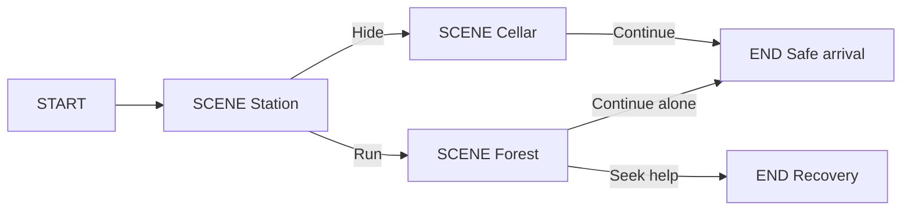

# Story node editor implementation plan

Status: version 2 authoring, production projection, subtitle and export flows implemented and built. Validation and the fresh desktop artifact are recorded in [STORY_NODE_EDITOR_IMPLEMENTATION_NOTES.md](STORY_NODE_EDITOR_IMPLEMENTATION_NOTES.md). The requirements below remain the acceptance reference; browser checks, native packaging and remaining human acceptance are reported separately.

Repository: `D:\Src\qamba-studio-oss`. Inspected HEAD: `b3e561f`. The working tree contains substantial uncommitted implementation, including the existing story editor. Treat that working tree as the baseline; HEAD alone does not describe it. Plan date: 7 October 2026, Europe/Riga.

## 1 Purpose and required result

Implement a visual, project-owned branching story editor with exactly one START node, any number of SCENE nodes, and one or more END nodes. A SCENE contains its narrative content, multilingual dialogue and the decisions offered after its video. Its output sockets represent those decisions. Connections determine which scene or ending follows each decision.

Clicking a SCENE opens the video editor for that node and selected language. The editor displays the node's exact content and preserves the graph when editing media. The author can return to the graph, create alternate paths, save the project, reopen it, simulate each path and export a portable game package linking decisions to the correct videos and subtitles.

Implement this as an extension of the current AntV X6 editor, storage and runtime. Do not create a second story system or replace working media generation. Existing film, series, music-video, model, upload and TTS features must remain available.

The game engine has not been specified. This plan therefore requires a versioned engine-neutral package and a working reference consumer. A Unity, Unreal or Godot plugin is outside this plan until a target is selected. Export is complete only when the reference consumer actually loads the exported files and follows both branches; exporting JSON alone is insufficient.

The latest request does not include a new workflow image. The diagram below expresses the written requirements, using the linked NodeEditor as an interaction reference.



The number of END nodes is independent of language. Translating an ending creates translated content on the same node, not a new path.

## 2 Library decision

Use `@antv/x6` 3.1.8 with `@antv/x6-react-shape` 3.0.1 and the existing React node cards. `StoryCanvas` adapts the authoring document to X6 models; native input/output ports preserve dynamic linking. Keep authoring persistence and undo/redo authoritative. See [X6 ports](https://x6.antv.antgroup.com/en/tutorial/basic/port).

The linked [beyse NodeEditor](https://github.com/beyse/NodeEditor) is a useful interaction reference for draggable nodes, named ports and separate editable/runtime exports. It uses a Python/Qt environment and distinguishes an editor scene file from an execution graph file. Embedding that application would introduce another UI runtime and packaging system. Keep its visual concepts and implement them in the existing React canvas. See its [environment specification](https://github.com/beyse/NodeEditor/blob/main/environment.yml) for the Python/Qt dependencies.

Do not install NodeEditor, PyQt or another node library for this work. Do not use a ComfyUI model workflow as a story graph: a story graph controls player traversal; a ComfyUI workflow generates media for one operation.

## 3 Existing code and exact gaps

Inspect these files again before implementation because the user may change them after this plan.

| Existing file under repository root | Existing responsibility | Required extension |
| --- | --- | --- |
| `src/components/story/StoryGraphView.tsx` | AntV X6 canvas, connections, node creation, selection, save and undo | START creation; SCENE choices; safe single-click editor handoff; explicit save state |
| `src/components/story/StoryNodeCard.tsx` | Cards and source/target handles; separate decision ports; scene editor button | START/SCENE/END labels; choice sockets on scenes; no START target handle; dynamic handle sizing |
| `src/components/story/StoryInspector.tsx` | Scene binding, separate decisions, conditions, ending fields | Scene-owned decisions, localized fields and dialogue |
| `src/lib/storyTypes.ts` | Graph document schema version 1 | Version 2 graph types and multilingual content |
| `src/lib/storySchema.ts` | New graph currently starts as a single ending | Version 2 START → SCENE → END default graph factory |
| `director/story_runtime.js` | Pure condition/effect validation and traversal | Explicit START and scene-owned choices with version dispatch |
| `src/lib/storyValidation.ts` | Port, reachability, cycle and readiness diagnostics | START rules, embedded choices, localization and media coverage |
| `src/lib/storyPersistence.ts` | Atomic graph saves, expected revision, snapshots, scene references, invalidation | Draft/completeness separation; migration; atomic graph/editor operations |
| `src/lib/db/storyGraphs.ts` | Local graph CRUD | Version-aware create/load/upgrade |
| `src/lib/localStore.ts` and `src-tauri/src/localstore.rs` | Project rows and native atomic persistence | New timeline binding fields, guards and migration |
| `src/lib/productionContext.ts` | Captures path/state/canonical inputs for a production unit | Locale and exact authoring-content hash |
| `src/lib/storyTimeline.ts` | `ensureUnitTimeline`, independent production-unit tracks | Draft node timelines and safe promotion to a production unit |
| `src/components/modals/SceneEditorModal.tsx` | Scene blueprints, shots, dialogue and takes | Story-context input and graph-backed authoring content |
| `src/routes/Workspace.tsx`, `src/stores/useTimelineStore.ts` | Timeline route and selected cut | Explicit story timeline selection; no episode-wide auto-sync on story cuts |
| `src/lib/storyDialogue.ts`, `worker/handlers/storytts.py`, `worker/story_audio.py` | Exact structured speech and cache/assembly | Stable dialogue-line IDs, chosen locale and subtitle timing |
| `src/lib/storyExport.ts`, `src-tauri/src/storyexport.rs` | Frozen export, approved variants, hashes and copied media | Multilingual version 2 package and subtitle/dialogue files |
| `scripts/gen_story_contracts.mjs`, `contracts/story/v1/` | Version 1 schema and conformance fixtures | Add version 2 contracts without overwriting version 1 fixtures |
| `scripts/story-ui-test.mjs`, `scripts/story-package-test.mjs` | Browser/editor and independent consumer checks | New authoring flow, language changes and branch-to-video checks |

Verified gaps: version 1 has no `start` node type; decisions are separate `decision` nodes; most authored strings are single-language; a scene single click selects it, while double click or its button opens a scene modal; that modal action does not implement the full selected-language timeline handoff. Existing export has reviewed media and attached subtitle assets, but not the complete multilingual dialogue/subtitle contract described here.

Preserve existing historical sources, canonical identity review, production variants, offline policy and approved-media hash checks. They are independent of the simpler default node palette.

## 4 Instructions for the implementing model

1. Follow tasks T01–T17 in order. Do not start a dependent task until its prerequisite tests pass.
2. Change only files required by the task. Never reset the working tree, discard user changes or delete old assets, graphs, takes or revisions.
3. Use stable UUIDs for graph, node, scene, choice, edge, dialogue-line and presentation identities. Do not use titles, array indexes, translations or filenames as IDs.
4. Keep one authoritative story document. AntV X6 state is a view of that document, not another persistence format.
5. Keep scene blueprints and production rows in Qamba's existing tables. Story content is authoritative for interactive authoring; beat dialogue generated from it is a production projection with provenance.
6. Keep existing jobs, cancellation, asset registration and worker execution. Do not add another queue or require a hosted service.
7. Do not generate media, translate text, alter a blueprint or download models merely because a node is selected.
8. Reuse the pure JavaScript runtime for the editor simulator and exported reference consumer. Do not implement a separate Python narrative interpreter.
9. All state conditions and effects remain allowlisted data. Never execute authored scripts or expressions.
10. Do not edit `src/lib/localSchema.ts` manually. Update the migration/schema inputs, then run `node scripts/gen_local_schema.mjs` and inspect its output.
11. Keep version 1 contract fixtures intact. Add explicit version dispatch; never accept version 2 documents under an unchanged version 1 schema.
12. Do not claim a feature complete based on a placeholder, disabled control, mocked successful export or compilation alone.
13. Do not commit, push, publish or download model weights as part of these tasks. Builds and synthetic local tests are allowed once implementation is authorized.
14. If the production model or TTS backend is unavailable, keep authoring usable and report the production prerequisite. Missing GPU models must not prevent adding a scene or editing its dialogue.

## 5 User interface contract

### 5.1 Project entry point

Expose a clearly labeled **Story** navigation item for interactive projects. Include **Create branching story** in project settings so discovery does not depend on knowing the existing narrative-mode setting. Linear projects remain linear until the author explicitly switches or creates an interactive story.

New story creation asks for a title, default language and additional languages. Defaults: title `Untitled story`, default language `lv`, additional language `en` offered but not selected automatically. Use a searchable language picker accepting valid BCP 47 tags, including region variants; do not limit authored content to a TTS provider's language list.

Create a real initial SCENE blueprint in the chosen project's selected storyboard, or create a new empty storyboard if none exists. New story creation must commit graph, scene and required storyboard together. The initial visible graph is START → SCENE → END and can be saved immediately with draft content.

### 5.2 Canvas layout

Show a node palette containing **SCENE** and **END**. START is created once and cannot be added again or deleted individually. Show advanced legacy node types in a collapsed **Advanced** section only when supported by the existing graph.

Toolbar: story selector, language selector, Add scene, Add ending, Fit graph, Undo, Redo, Validate, Simulate, Export, and a save indicator. Use `Saved`, `Saving`, `Unsaved changes` or `Save failed`; do not show `Saved` after an unsuccessful native write.

Cards show node kind, localized title, thumbnail when present, dialogue-line count, media readiness for the selected language and decision labels. Long text belongs in the inspector/editor. Node width must accommodate translated labels without overlapping handles. Display a port label beside each outgoing socket.

Persist node positions and viewport. Restore them on reopen rather than running `fitView` on every render. Provide Fit graph as an explicit action.

### 5.3 Click and editing behavior

Single click or Enter on a SCENE selects it and opens `StorySceneEditorPanel` beside the canvas through the handoff in section 9. The panel has Content, Shots and Timeline tabs and reuses the existing scene/shot/timeline components. Content includes localized story text and decisions, so opening it does not make node authoring inaccessible. A click on a connection handle, text input, choice control or embedded button must not open the editor. Starting a drag must not open it either.

Use the flow library's click event after selection, with a small movement threshold if needed; do not attach navigation to pointer-down. Include `nodrag`/`nopan` classes on form controls. Selecting START or END opens their inspector and never creates a timeline.

Keep a separate **Open full video editor** button for users who want a full timeline route. The single-click behavior and button call the same application command. Opening either preserves the selected graph/node and viewport for return navigation.

## 6 Version 2 data contract

The following is a required contract, not a suggestion to mix fields arbitrarily. Implement the types before the UI.

```ts
type Locale = string; // Canonical BCP 47 tag, for example lv, en, en-GB.
type LocalizedText = Record<Locale, string>;

interface DialogueLineV2 {
  id: string; // Stable UUID across every translation of this line.
  speakerId: string | null; // Null is narration, never a made-up character UUID.
  text: LocalizedText;
  delivery: LocalizedText;
  emotion: string;
  intensity: number; // 0..1
  pace: number; // >0, validated against selected TTS controls at production.
  offscreen: boolean;
}

interface ChoiceV2 {
  id: string;
  label: LocalizedText;
  condition: Condition;
  effects: Effect[];
  iconAssetId: string | null;
  historicalAnnotation: LocalizedText;
  educationalExplanation: LocalizedText;
  sourceRefs: CitationRef[];
  tags: string[];
}

interface SceneContentV2 {
  synopsis: LocalizedText;
  visualPrompt: LocalizedText;
  decisionPrompt: LocalizedText;
  dialogue: DialogueLineV2[]; // Order is authored playback order.
}

interface SceneNodeV2 {
  id: string;
  type: "scene";
  title: LocalizedText;
  sceneId: string; // Existing scenes table UUID, same project.
  content: SceneContentV2;
  transitionMode: "continue" | "choice";
  choices: ChoiceV2[];
  condition: Condition;
  enterEffects: Effect[];
  sourceRefs: CitationRef[];
  tags: string[];
}

interface GraphDocumentV2 {
  schemaVersion: 2;
  engineVersion: "2.0.0";
  entryNodeId: string; // Must identify the sole START node.
  defaultLanguage: Locale;
  languages: Locale[];
  nodes: StoryNodeV2[]; // Discriminated union including start, scene, ending.
  edges: StoryEdge[]; // Existing stable edge IDs and sourcePort semantics.
  stateDefinitions: StateDefinitions;
  initialState: GameState;
  editor: {
    positions: Record<string, { x: number; y: number }>;
    viewport: { x: number; y: number; zoom: number };
  };
  metadata: Record<string, unknown>;
}
```

Define START as `type: "start"` with the common ID/title/condition/effects/citation/tag fields. Its condition must be null and its enterEffects empty in this release; initial state is configured on the graph. Define END as persisted `type: "ending"` to preserve the existing naming convention, but render its card label as END. It has localized title, historicalExplanation and educationalSummary, plus existing classification/outcomes. END owns no scene blueprint in this release. Use a terminal SCENE before END when an ending needs a video.

Keep advanced `decision`, `conditional` and `historical_event` node types for migrated stories. Localize their human-readable strings under the version 2 schema. New simple stories use scene-owned choices and do not require separate decision nodes.

Do not put target-node IDs inside choices. A choice owns its identity and label; the edge owns the destination. This prevents contradictory destinations. `sourcePort` is `next` for START and continue-mode scenes, or the choice UUID for choice-mode scenes. Multiple incoming edges are allowed on SCENE/END, enabling reconvergence. Exactly one outgoing edge is allowed for each source port.

### 6.1 Language resolution

Canonicalize tags with `Intl.getCanonicalLocales` and reject invalid tags. `defaultLanguage` must be in `languages`; duplicates are rejected after canonicalization. Authoring selects an exact declared locale. Runtime resolution order is exact requested locale, explicitly declared base-language locale, then graph default. Return the resolved locale and a fallback flag; never silently label default-language text as a translated language.

Store authored Unicode text unchanged, including Latvian accents and intentional newlines. Normalize only language tags and blank detection. Do not normalize away meaningful whitespace or punctuation in dialogue. No automatic machine translation is included; a missing translation has a visible indicator and editable empty field.

Narrative logic is independent of locale. Conditions, effects, choice IDs, ports and destinations do not change when the language selector changes. Reordering choices changes display order, not IDs or state effects.

### 6.2 Content ownership

The graph's SCENE content is the authoritative interactive text. The real `scenes` row remains the authoritative production blueprint for cast, environment, beats/shots and visual assets. Production projections copy exact selected-language dialogue from the graph into a unit's storyboard and retain source line IDs and a content hash. Never silently overwrite a shared base scene or another language's production dialogue on a node click.

The node video editor reads story text through a story-aware adapter and saves it back through the graph transaction. Existing direct `Beat.dialogue` editing remains unchanged for linear projects. Editing a projected dialogue line in an interactive scene routes to the corresponding graph dialogue-line ID; unbound legacy beat dialogue must be imported explicitly before it becomes graph-owned.

## 7 Connection and traversal rules

| Node | Incoming handles | Outgoing handles | Valid complete-state requirement |
| --- | --- | --- | --- |
| START | None | `next` | Exactly one START, exactly one outgoing edge |
| SCENE continue mode | One target socket accepting multiple edges | `next` | One outgoing edge, no choices |
| SCENE choice mode | One target socket accepting multiple edges | One per choice UUID | At least one choice; one edge per choice; branching normally has two or more |
| END | One target socket accepting multiple edges | None | At least one END in the graph; zero outgoing edges |

Reject connections to START, connections from END, self-links, duplicate edge IDs, foreign nodes and duplicate outgoing ports. Dragging a new edge onto an occupied port must ask to replace the connection or refuse it; do not silently remove the old edge as the current `connect` implementation does. An author-confirmed replacement preserves the edge UUID and updates its target.

Cycles remain unsupported in this implementation. Graph reconvergence is supported. Adding loops requires a later runtime contract with explicit visit limits and save-game semantics.

Switching a SCENE from continue mode to choice mode requires explicit confirmation if its `next` connection exists. Preserve that existing edge's UUID and destination by creating the first choice and changing the edge's sourcePort to its new choice UUID. Additional choices begin unconnected. Switching back to continue mode requires selection of the one connection to retain; after confirmation, remove other choices/edges together and change the retained edge's sourcePort to `next`. Cancel leaves the graph unchanged. Never discard branch destinations just because a dropdown changed.

Player sequence:

1. Start a session at START using declared initial state.
2. Traverse START's sole next edge and enter the first SCENE.
3. Select that scene's presentation using current state and requested language.
4. Play the video with the selected subtitle track. Playback itself does not mutate narrative state.
5. On successful video completion, display the available choices, or a Continue action for continue mode. Do not automatically apply the first choice.
6. Commit a selected edge exactly once. Preserve existing runtime ordering: validate source availability; apply choice effects; validate/apply edge effects; evaluate target condition against the resulting candidate state; apply target enterEffects; commit the new session atomically.
7. If any step fails, leave the original session unchanged. A click twice or duplicate playback callback must not apply effects twice.
8. Entering END sets ended/outcome. Display its localized content and stop traversal.

Extend `listChoices` and `stepSession` so scene-owned choices have the same condition/effect semantics as existing decision nodes. Language resolution is a presentation operation, not a state-effect operation. No hidden virtual decision nodes or generated edge IDs may appear in saved histories or exported node bindings.

## 8 Saving and migration

### 8.1 Separate draft storage from readiness

An author must be able to save a scene before connecting its choices. Add two explicit validation levels:

- Structural validation for every save: supported version, valid field shapes, stable/unique IDs, safe condition/effect grammar, project ownership, valid referenced rows and valid existing edge endpoints/ports. Exactly one START is required for newly saved version 2 graphs.
- Completeness/readiness validation for Simulate and Export: required outgoing ports connected, at least one reachable END, no reachable dead ends, no cycles, required localized fields and media coverage.

Incomplete connections produce visible draft diagnostics but do not reject a structurally valid draft save. Illegal references, unsafe expressions, duplicate IDs and cross-project scenes always reject the save. Do not turn every validation error into a warning to achieve draft saving.

Keep autosave through `saveGraphInStore`/native project persistence with expected revision checks. Text editors keep a local draft until valid commit; commit on blur or explicit Apply, then flush pending edits before scene navigation/export. Avoid a project write per keystroke. A drag saves once on drag stop; viewport changes debounce before persistence.

Save graph document, derived scene-reference rows, previous-revision snapshot and invalidation in one transaction. On error, no part of the mutation remains. Unsaved text remains available for retry. A revision conflict must offer reload or retain the local draft for review; never overwrite the other revision silently.

### 8.2 Version 1 migration

Add a pure migration helper returning a version 2 candidate plus a report. It must not persist as a side effect of rendering.

1. Load and retain the original version 1 document and revision.
2. Preserve every existing node, edge, scene, choice and historical source ID.
3. Allocate one new START UUID and one new edge UUID once for this migration attempt. START points to the original `entryNodeId`; set the new entryNodeId to START.
4. Wrap original human-readable strings in `{[oldDefaultLanguage]: originalText}`. Declare only the original default locale; do not fabricate translations.
5. Mark migrated scene nodes as continue mode with no embedded choices. Initialize their content maps to empty maps and dialogue to an empty array until explicit legacy-content import. Preserve separate old decision nodes and their edges as advanced nodes. Do not automatically fold them into scenes, because incoming paths, entry effects and decision conditions may change meaning.
6. Import legacy scene/beat dialogue only through an explicit import step that records the selected storyboard and assigns stable line IDs once. A missing line translation stays missing.
7. Run structural checks and compare traversal witnesses: ignore the one new initial START edge when comparing old/new edge histories; all subsequent state changes and outcomes must match.
8. Commit the upgrade with a named reason, expected revision and preserved previous document. Save new document schema version as 2 and graph row schema_version as 2. Keep old revision schema metadata accurate.
9. Mark existing production units stale after migration, retaining their media and approval history, because their old graph revision/context does not prove version 2 input equivalence. If migration cannot preserve traversal semantics, retain the version 1 graph and show the migration report. Never partially upgrade it.

Keep version 1 runtime behavior available through version dispatch or a frozen version 1 implementation. Keep existing exported version 1 packages readable by the reference consumer. Use runtime `2.0.0` only with version 2 graph/package contracts. The native exporter currently checks `1.0.0`; that check must be updated deliberately with a supported-version allowlist.

## 9 Node to video editor handoff

Create `src/lib/storyEditorBridge.ts`. Its public entry point is:

```ts
openStorySceneEditor({
  projectId, graphId, expectedGraphRevision, nodeId, language,
  productionUnitId?: string
}): Promise<StoryEditorContext>
```

Define the context with project/graph/revision/node/scene IDs, canonical language, current localized content, fallback indicators, dialogue-line IDs, selected draft timeline ID, optional production unit ID and an authoring-content hash.

Required behavior:

1. Flush the selected inspector's pending valid edits. If validation or saving fails, keep the author on the graph and show the error.
2. Re-read the graph at the expected revision. Confirm project ownership and that nodeId identifies a SCENE. Resolve the bound scene's storyboard/episode back to the same project.
3. Validate the requested language is declared; opening a language with incomplete text is allowed for editing, with visible empty/fallback indicators. Production remains blocked until required exact dialogue exists.
4. If a production unit ID is provided, verify it belongs to the same project, graph, node and locale and is not silently substituted by the newest unit.
5. Otherwise find or create a draft story timeline for `(graphId, nodeId, language)`. Creation is idempotent and atomic. It does not capture or approve a production unit.
6. Load that timeline with `useTimelineStore.getState().load(timelineId)` and show the matching scene context. The docked panel keeps the graph route; the full editor uses `?timeline=<uuid>&story=<graphId>&node=<nodeId>&lang=<locale>` on the existing episode timeline route, with every parameter checked against the loaded project. Never rely on whichever timeline happened to be active.
7. Preserve graph selection/viewport. Provide Return to story, selecting the same node on return.
8. Opening the same scene/locale twice reuses its draft timeline. Opening another language produces/selects that language's draft timeline without moving the first language's clips.

Extend the `timelines` row with nullable `story_graph_id`, `story_node_id`, `story_language` and `story_content_hash`. Add a partial uniqueness constraint for draft story timelines where production_unit_id is null. `story_node_id` references a JSON document node, so enforce its existence and project ownership in application/native guards; do not invent a SQL foreign key to a nonexistent node table. Keep graph/node/locale identity separate from an episode's linear timeline.

On story timeline routes, `TimelineView` must use the explicit timeline UUID. Disable episode-wide generation-block auto-sync for these cuts; otherwise the current episode auto-sync may import every branch into one scene timeline. Sync only the selected unit's blocks or explicit scene draft assets.

Creating a node does not require a rendered clip. The empty editor displays exact dialogue and scene content with empty media tracks, plus an explicit Generate or Import action. Available tracks: Video, Dialogue, Music, Ambience and SFX. Do not assume dialogue must fit a fixed five-second video; splitting/planning is explicit and must preserve the complete text. At widths below 1240px, show the selected scene panel as a full-width drawer with an explicit Return to canvas control; do not inherit a CSS rule that hides the panel completely.

After an explicit capture command, bind the draft timeline to the chosen production unit only if its graph/node/language/content hash matches. Keep alternate units and takes separate. Shared narrative scene destinations can resolve to different approved videos for different states without duplicating the graph node.

## 10 Multilingual speech and subtitles

One dialogue-line UUID identifies the same narrative line in all languages. Store text and delivery per locale. The UI must show speaker, selected locale, exact line, emotion, intensity, pace and offscreen setting. Narration uses a declared narrator voice configuration; do not pass null as a character identity into the existing `normalizeDialogue` function without extending its contract.

At production, select exact speech text for the chosen locale. If it is missing, refuse TTS; subtitles cannot justify speaking another language silently. Use the actual provider adapter mapping: for example, Supertonic uses `lv` while Qwen's Latvian preset uses Auto. Preserve the requested narrative locale in asset provenance even when the provider token is Auto. Changing story language is distinct from choosing a supported TTS token.

Record generated clip duration and final timeline position. Maintain a cue map per approved presentation and subtitle locale:

```ts
interface SubtitleCueV2 {
  id: string;
  lineId: string;
  speakerId: string | null;
  startMs: number;
  endMs: number;
  text: string;
}
```

Cue bounds use the approved scene video's timeline, not the original prompt duration. Validate integer milliseconds, nonnegative start, end > start, end <= measured video duration and monotonic cue order. For this first release, reject overlapping cues; split overlapping dialogue into readable sequential cues or require explicit later overlap support. Never invent uniform cue timings for a narrated paragraph.

Separate speech locale from subtitle locale. An `lv` video can have reviewed English subtitles using the same line IDs and timing positions. A fully English-dubbed video is a separate presentation with its own durations and cue maps; do not reuse Latvian timings automatically.

Add deterministic UTF-8 WebVTT and SRT serializers. WebVTT starts with `WEBVTT`, blank line, cue ID, `HH:MM:SS.mmm --> HH:MM:SS.mmm`, text, blank line. SRT uses numbered cues and comma milliseconds. Convert potentially meaningful cue markup to safe visible text or escape it according to the selected format; reject text that would create a forged cue/timing line. Round-trip tests must retain Latvian characters and line breaks.

Approved presentation metadata contains structured dialogue, timing maps, subtitle assets/hashes, actual video duration, speech language, supported subtitle languages and input-content hash. Regenerating dialogue or changing timing marks those presentation/subtitle approvals stale. Never keep an approved subtitle file attached to a different video just because both scenes have the same title.

## 11 Export and reference game playback

### 11.1 Package files

Extend the existing native hashed-media package writer. Export a directory with:

```text
manifest.json
graph.json
scenes.json
dialogue.json
localization.json
historical.json
assets.json
media/<sha256>.mp4
subtitles/<presentationId>/<locale>.vtt
subtitles/<presentationId>/<locale>.srt
runtime/story_runtime.js
runtime/story_player.js
runtime/conformance.json
reports/validation.json
README.md
```

`graph.json` contains runtime topology, node/choice IDs, localized labels, conditions and effects. Editor positions/viewport are omitted from the playable package but remain in the project. An optional editor-source export can retain them separately; the playable package must not depend on canvas coordinates.

`scenes.json` maps nodeId to sceneId and an array of presentations. Each presentation contains presentationId, unitId, state condition, speech language, supported subtitle locales, video `mediaPath`, measured duration, subtitle paths, dialogue-line IDs and approved input/media hashes. Use exactly one matching presentation for every reachable `(nodeId, effectiveState, selectedSpeechLanguage)` combination. Zero matches is missing media; multiple matches is ambiguity. Both block playable export.

`dialogue.json` contains stable line IDs, speaker identities, exact translated text and per-presentation cue maps. `localization.json` declares default language, supported UI/subtitle/speech language sets and fallback policy. `manifest.json` declares package schema version 2, runtime 2.0.0, project/story/revision IDs, entry node ID and a hash/byte-count inventory of every file. Optional speech language modes not fully produced must not appear as fully supported playable locales.

Keep media references relative to the package root. Do not export absolute Windows paths, local server URLs, asset:// URLs, API keys or authenticated storage URLs. Keep existing safe-path checks, reviewed-file SHA-256 verification, staging-directory cleanup and final atomic rename. Do not overwrite an existing package silently.

Use the existing `mediaKey` → `mediaPath` replacement mechanism for copied source assets; add explicit safe writers for generated subtitle text. Manifest hashes refer to final rewritten file bytes. The graph hash excludes editor metadata and must be stable when the canvas layout changes.

### 11.2 Export modes

Offer **Authoring data** and **Playable package** as clearly different choices. Authoring data may contain incomplete drafts and no videos, but includes structural validation and an explicit `playable: false` manifest field. Playable package requires full graph completeness, locale coverage, current approvals and valid subtitle timing. Neither mode changes project approval status.

Prepare export from a frozen project snapshot. If project revision changes during preparation or copying, abort safely or use a complete explicitly pinned snapshot with verified assets; do not combine old dialogue with newly changed video references.

### 11.3 Reference consumer contract

Create an engine-neutral player adapter around the existing runtime:

```ts
loadPackage(files): ValidatedPackage
startStory(package, { speechLanguage, subtitleLanguage }): PlayerSession
getCurrentPresentation(session): ScenePresentation | EndingPresentation
markVideoCompleted(session, presentationId): PlayerSession
getAvailableChoices(session): LocalizedChoice[]
choose(session, choiceId): PlayerSession
saveSession(session): JsonSave
restoreSession(package, save): PlayerSession
```

`choose` looks up the edge by current node and choice UUID, never by localized label. It is allowed only after the current presentation completes. Include a transition nonce or presentation-completion token so duplicate callbacks cannot advance twice. Reloading a save verifies story ID, graph revision and semantic graph hash; mismatches require a controlled migration or fresh start, never arbitrary replay against a different graph.

Build a small local browser reference player using an HTML video element and subtitle track, with visible choice buttons and ending content. It must load only exported package files and shared runtime code; it must not import Qamba stores, database functions or a running Qamba server. For a non-JavaScript game engine, JSON contracts and conformance fixtures define the adapter behavior; implementing that engine's runtime is a separately scoped task.

## 12 Implementation tasks

### T01 Record the baseline

Read all files in section 3. Record relevant function names and current call sites in the implementation notes. Read applicable AGENTS/CLAUDE instructions if present. Run `git status --short`; preserve all pre-existing changes. Identify current tests for graph saves, runtime, unit isolation and export.

Done when: the implementing agent can name the current graph save command, scene modal action, timeline loader, schema generator and native export writer. No dependency installation or code replacement is needed.

### T02 Add version 2 types and contracts

Edit `src/lib/storyTypes.ts`; add a discriminated GraphDocumentV1/GraphDocumentV2 union. Create `src/lib/storyLocalization.ts` and `src/lib/storyLocalization.test.ts`. Add version 2 schema generation to `scripts/gen_story_contracts.mjs`; generate `contracts/story/v2/graph.schema.json`, `package.schema.json`, state schema and conformance fixtures. Preserve v1 files byte-for-byte unless a separate explicit v1 bug repair is required.

Validate node types and allowed fields separately by document version. Required START/SCENE/END fields must not be accepted by a loose `any` shape. Test locale canonicalization, invalid tags, exact/base/default fallback reporting, unchanged Unicode text and stable IDs across translation changes.

Done when: a complete version 2 sample validates and incorrect START fields/duplicate IDs/unsafe conditions fail, with v1 fixtures still passing.

### T03 Extend deterministic traversal

Edit `director/story_runtime.js`, its declaration file if present, and `src/lib/storyRuntime.test.ts`. Dispatch by schema/runtime version. Add START traversal and embedded SCENE choices. Preserve advanced node behavior and the current condition/effect ordering. Include complete and intentionally incomplete v2 fixtures.

Tests: two choices reach different endings; one Continue reaches END; reconverged state remains different; blocked choices are unavailable; invalid transition rolls back; changing locale does not change outcomes; duplicate choice labels remain distinguishable by UUID.

Done when: both v1 and v2 conformance fixtures execute with their intended runtime version and no synthetic decision nodes are needed for v2 scenes.

### T04 Implement draft and readiness validators

Edit `src/lib/storyValidation.ts` and runtime validation exports. Add explicit validation mode parameters instead of one permissive global toggle. Enumerate diagnostics for missing/duplicate START, incoming START edge, outgoing END edge, duplicate source port, missing choice edge, illegal self-link, cycle, missing ending, unreachable node, no available choice and missing translation.

Test structural draft saves separately from simulation/export readiness. Bound reachability/state analysis using existing limits; exhaustion is `unknown`, not proven coverage. Playable export cannot proceed on unknown coverage.

Done when: an unconnected new scene saves as a draft, but Simulate/Playable export explains the missing connection and refuses it.

### T05 Add graph upgrade and atomic persistence

Create `src/lib/storyMigrations.ts` and tests. Edit `storyPersistence.ts`, `db/storyGraphs.ts`, `localStore.ts` and native graph/reference guards as required. Apply section 8's explicit upgrade. Update graph row schema_version on upgrade; preserve old revision documents with their original versions.

Test native-save failure rollback, revision conflicts, save/reopen, v1 upgrade idempotency and traversal equivalence. Avoid invalidating production on editor-only position/viewport changes. Initially mark all units for a graph stale after a semantic v2 content/choice change; finer locale-only invalidation is optional later and must not weaken correctness.

Done when: upgrading and saving survives application restart, cannot happen repeatedly with new START IDs, and never loses the original graph revision.

### T06 Create default nodes and their blueprints

Edit `storySchema.ts` and graph creation commands. Create a helper that creates a graph plus a real initial scene/storyboard transactionally. Update the create-story UI to collect title/locales. START → SCENE → END is created with stable IDs and usable positions.

Add SCENE creates a real scene row in the selected project's storyboard, not a random missing sceneId. Add END creates an ending node without a scene row. Deleting a SCENE removes graph edges and references in one mutation; its underlying blueprint/media are retained unless separately deleted through their own guarded workflow. START deletion and duplicate START creation are rejected.

Done when: a new story opens with all three visible node kinds, saves and reopens, and has a genuine editable scene blueprint.

### T07 Implement the scene content inspector

Create `StoryLanguagePicker.tsx`, `StoryDialogueEditor.tsx` and `StoryChoicesEditor.tsx` under `src/components/story/`; edit `StoryInspector.tsx`. Show exact locale fields, translation completion and graph-owned choices on SCENE. Add/remove/reorder dialogue using stable IDs. Adding a choice creates its UUID once; deleting a choice removes its outgoing edge atomically.

Switching locales flushes pending valid edits first. If invalid, keep the locale selected and expose the error. Copy-source-language text is an explicit action; do not prefill a missing translation invisibly. Choice deletion is reviewable because it removes a branch connection.

Done when: Latvian and English content are independently editable, choice/line IDs do not change on reorder or translation, and errors preserve the author's draft.

### T08 Implement cards and safe connections

Edit StoryNodeCard, StoryGraphView and `src/styles/storyGraph.css`. Render START, SCENE and END labels, choice handles and media-language status. Use a reusable pure helper `storyPorts(node)` for cards, connection validation and export validation so those surfaces agree.

Measure React card dimensions and choice row positions with ResizeObserver when ports or language change, then update X6 native port coordinates. Validate a connection before mutating; show a replacement dialog for occupied ports. Add edge deletion/reconnection and proper undo.

Done when: adding/removing/reordering a choice does not move an existing connection to another choice; START/END direction rules cannot be bypassed with drag gestures.

### T09 Add story timeline schema and guards

Add a new timestamped SQL migration; do not rewrite the existing story migration. Add timeline binding fields and partial draft uniqueness. Update `contracts/local-schema-extensions.json` only if a new table is actually needed; nullable columns alone do not require a new ownership table. Regenerate localSchema.

Update native project format/migration only as required by the new row shape. Preserve unknown/newer format refusal and backup behavior. Validate story graph/node/project/locale references in both normal application writes and native persistence. Keep linear timeline defaults unchanged.

Tests: cross-project graph binding fails; missing node fails; same graph/node/locale cannot create duplicate draft timelines; different locales are distinct; old projects reopen safely.

Done when: save/reopen preserves story timeline identity and existing linear timelines still load.

### T10 Implement the editor bridge and click handoff

Create `storyEditorBridge.ts`, its tests and `src/components/story/StorySceneEditorPanel.tsx`. Edit workspace routing/store, SceneEditorModal and StoryGraphView. Extract reusable scene/shot/timeline bodies from existing components where needed; both the docked panel and full editor use those bodies. Implement all steps in section 9. Use the existing scene editor with an optional story context, not an unrelated copy of the modal.

Make pending edits flushable. Handle rapid A → B clicks using a request sequence token so a slow A load cannot replace B's editor. Add Return to story preserving viewport and language. Ensure scene editor's authoring fields use graph-backed text and never overwrite a base scene automatically.

Done when: clicking a SCENE displays its exact selected-language content and its isolated timeline; dragging the same card does not navigate; clicking END does not create media rows.

### T11 Integrate production units and dialogue projections

Edit `productionContext.ts`, `storyProduction.ts`, `storyTimeline.ts`, `storyIntegrity.ts` and relevant worker input validation. Extend the production context contract with selected speech locale, ordered stable dialogue IDs, exact localized content hash and subtitle dependencies. Version the production context if its validated schema changes; do not simply add fields that its allowlist ignores.

Explicit capture creates a unit-specific storyboard/projection without overwriting the base blueprint or another unit. Map each projected beat line back to graph/node/line/locale and content hash. Unit render and approval require current inputs. New translations, text changes or choice changes invalidate affected approvals conservatively.

Done when: two language units for the same narrative node have independent clips/audio/timing, and two state variants cannot share approval merely because their sceneId matches.

### T12 Add measured subtitle generation and editing

Create `src/lib/storySubtitles.ts` and tests. Add a subtitle timing editor in the story-aware video workspace. Use measured TTS durations and actual cut positions as initial timing; allow author corrections. Map translated subtitle text to existing line IDs for an approved video, with review of its own text and timing.

Generate WebVTT and SRT, register them as project assets through existing media storage and retain hashes. Test milliseconds around second/hour boundaries, diacritics, multiline text, empty/missing translation, invalid/overlapping/out-of-bounds cues and regenerated video duration.

Done when: both subtitle formats load against the selected scene video with accurate reviewed timings; dialogue JSON contains the same exact text and line IDs.

### T13 Extend frozen export and native packaging

Edit storyExport, StoryExportPanel and native storyexport; add v2 contract tests. Implement the two export modes and complete file contract. Include all selected locales and state/media bindings from a frozen snapshot. Preserve existing review hashes and exactly-one-match presentation validation, extended by speech language.

Add checks for unsafe generated paths, hash mismatches, invalid subtitle durations, missing language video coverage, ambiguous presentation conditions and project changes mid-export. The Rust writer must accept supported v1/v2 contracts explicitly and reject unsupported versions. Regenerate fixtures and update consumers together.

Done when: the copied package has no machine-specific media paths, all file hashes verify and exported choice IDs resolve to the correct node/video in both languages.

### T14 Implement the independent reference player

Create `director/story_player.js` with pure presentation/session helpers around shared runtime; add a standalone consumer under `examples/story-player/` with package-file input, video playback, subtitles, decisions and ending display. Ship the runtime/player files through native resources and export packaging.

Load files using supported local browser file selection or a small local static server for the package; do not rely on cross-origin file:// behavior. Include clear player loading instructions. Use safe text rendering for authored labels/subtitles, never authored innerHTML.

Tests: both endings reached; exact selected media played; choices wait for completion; duplicate completion/choice event ignored; save/restore stable; graph-version mismatch rejected; missing media fails visibly; locale fallback reported.

Done when: the reference player can run the exported package after Qamba is closed.

### T15 Add end to end acceptance fixtures

Extend story-ui and story-package scripts; add focused tests alongside existing runtime/persistence/unit-isolation tests. Build a synthetic fixture with one START, a Station decision scene, Cellar and Forest scenes, reconvergence and two endings, plus Latvian/English text. Use local synthetic videos with visibly distinct scene/variant identifiers; do not rely on downloaded models for these tests.

Cover: create, edit, connect, drag, undo, save, close/reopen, change locale, click-to-editor, isolated cuts, speech text provenance, reviewed subtitles, export, independent player and both ending witnesses. Include a cross-project tampering fixture and a native-write failure fixture.

Done when: the actual UI Save/export actions are exercised and the external consumer selects the expected video/subtitles for every witnessed route.

### T16 Document and verify the desktop build

Update `docs/CHRONOLATVIA_STUDIO.md` only after behavior exists. Document the exact Story navigation, node types, language controls, click handoff, export modes and reference player. Keep this plan as proposed/implemented task evidence; do not rewrite it into an unsupported completion claim.

Run TypeScript checking, `npm test`, relevant Python worker tests, `cargo test --manifest-path src-tauri/Cargo.toml --lib`, graph UI tests and the independent package test. Use `npm run tauri:build -- --no-bundle` for a local desktop build. Check the actual artifact's timestamp and resources; if Windows locks the running executable, preserve it and provide a verified fresh dated build beside its resources.

Do not report that a model-generated clip proves full game-engine compatibility. Report native compilation, browser UI checks, independent consumer checks and human media review separately.

Done when: a fresh build contains the new UI/runtime/resources, documentation points to that build and validation results identify any real limitation.

### T17 Review the user acceptance walkthrough

Run section 13 from a new project, then from an existing version 1 project. If any step cannot be completed without devtools, direct JSON editing or a fake success path, fix it before marking the feature complete.

## 13 Final acceptance walkthrough

1. Create a local interactive project and choose Latvian as default plus English as an additional language.
2. Open Story. See exactly one START, one real SCENE and one END.
3. Rename the first scene Station; add Latvian/English synopsis, prompt and two speaker/narrator dialogue lines.
4. Change it to choice mode; add Hide and Run with translated labels.
5. Add Cellar and Forest scenes and a second END. Connect Hide → Cellar → Safe ending and Run → Forest → Recovery ending.
6. Add a reconverged scene/path and verify the chosen state survives reconvergence.
7. Attempt a second START, an edge into START, an edge from END and a self-link. Each is refused visibly.
8. Add an unfinished scene and save. Draft saving works; validation marks its missing links and playable export refuses it.
9. Finish or explicitly remove the unfinished branch. Close/reopen the project. Node contents, positions, languages and choices are unchanged.
10. Click Station. The video editor opens with Station's exact selected-language content and isolated scene timeline. Dragging Station does not open it.
11. Switch to English. English text appears without modifying Latvian; the English timeline is distinct. Return to the graph at its saved viewport.
12. Import synthetic local scene videos; create/review valid production presentations and subtitle timings. Translation-only subtitle tracks can accompany one dubbed video; additional dubbed videos are declared only when produced.
13. Export Authoring data and inspect its explicit non-playable status. Export Playable package after fixing all readiness issues.
14. Load Playable package into the independent player. Choose Hide, then Run in separate fresh sessions. See the correct video and ending each time, with the chosen subtitle language.
15. Save and restore a player session before a decision. State and available choices match. A mismatched graph hash is rejected.
16. Modify a dialogue line after approval. The affected production/export readiness becomes stale until media/subtitles are reviewed again.
17. Verify linear film editing and the existing image/video/TTS controls still operate independently of Story.

## 14 Completion evidence required

Deliver the changed-file list, exact fresh executable path, test results, native/browser/consumer verification scope and remaining human review requirements. Include at least these artifacts: full canvas screenshot, selected SCENE video-editor screenshot, both-language subtitle samples, exported manifest, verified file hashes and two ending playback witnesses.

Implementation is complete only when the author can create, save and reopen the START/SCENE/END graph; author and use multiple languages; open a node's isolated video editor; link decisions to the correct scene media; export dialogue and timed subtitles; and traverse the exported graph outside Qamba. A library installation or a node-shaped visual mockup does not satisfy those requirements.
